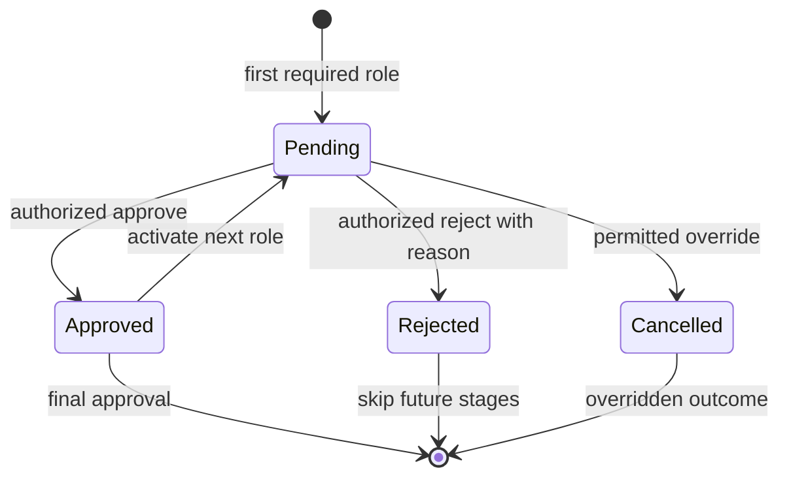

# Approval workflow architecture

## Creation and atomic boundary

`DecisionSubmissionService` creates an `ApprovalWorkflow` only when the
immutable decision disposition is `ManualApprovalRequired`. Auto-approved and
rejected decisions pass no workflow to persistence. The existing
`IDecisionTransaction` receives the purchase request, decision, optional
workflow and optional idempotency record together. The Phase 15 adapter must
commit that set atomically and enforce one workflow per eligible request.

No endpoint or persistence adapter exists in Phase 11. The contracts are the
compile-safe boundaries required for later Identity, API and PostgreSQL phases.

## Ordered plan and progression

The evaluator and workflow builder share one canonical role order:

1. `DepartmentApprover`
2. `ProcurementApprover`
3. `SecurityApprover`
4. `FinanceApprover`
5. `SeniorApprover`

The plan removes duplicate roles and rejects empty or unknown plans. The first
stage starts `Pending`; the remainder start `Waiting`. Approval moves the
current stage to `Approved` and activates the next stage, or completes the
workflow and request when no stage remains. Rejection requires a reason, moves
the current stage to `Rejected`, moves future stages to `Skipped`, and rejects
the workflow and request.

Exactly one stage is pending while the workflow is active and no stage is
pending after completion.

## Authorization and resource scope

Commands never accept actor identity or approver role. `ICurrentUserContext`
supplies the actor ID and `IApprovalAuthorization` supplies roles or the
explicit override permission. The application verifies the trusted scope and
the domain independently checks that the selected role equals the current
stage role. Wrong-role actions make no state change and no transaction commit.

Inbox queries are offset/page-size bounded to 100 and receive only authorized
roles. A requested filter must be a member of that trusted set. Detail queries
receive user ID, trusted roles and override permission and return explicit
projections rather than domain or future EF entities. The application applies
a second role-scope check to the returned detail. ASP.NET Core named policies
and resource handlers are Phase 13; these ports are their deny-by-default
application boundary.

## Concurrency and duplicate actions

Stage actions require the current application-managed token. Successful
actions rotate the acted stage token. Activating a waiting stage also rotates
its token, preventing a client that observed a future stage from reusing that
old token after activation. Stale tokens return `domain.concurrency-conflict`;
waiting, completed and repeated actions return `approval.not-actionable`.

`IApprovalActionTransaction` loads workflow and request together and commits
them together. Its later EF implementation must map stage tokens as concurrency
properties and translate store conflicts to the stable concurrency response.

## Override and audit source

Override requires `CanOverrideDecision`, a non-empty reason, a terminal target
of approved or rejected, and the fresh current-stage token. It cancels the
remaining actionable stages and records the actor, UTC time, reason, target and
the unchanged original `ManualApprovalRequired` disposition. A
`DecisionOverrideRecordedDomainEvent` and its controlled audit mapping preserve
this evidence. Phase 12 will append the actual tamper-evident audit record in
the same transaction; Phase 11 does not claim audit-chain persistence.

## Later-phase boundaries

- Phase 12 persists approval audit/outbox effects.
- Phase 13 implements Identity roles, named policies and resource handlers.
- Phase 15 maps aggregates and projections to PostgreSQL and exposes approval
  endpoints with ETags and problem details.
- Phase 19 implements the accessible, conflict-aware approver UI.
