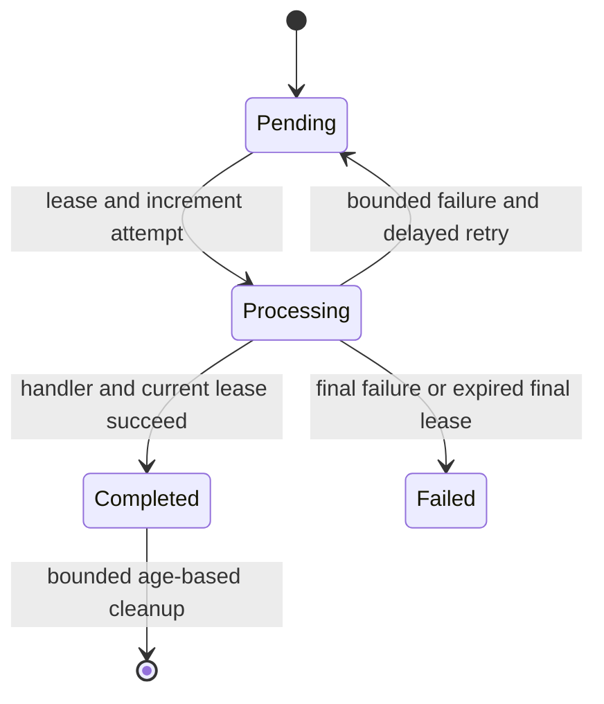

# Audit, outbox and notifications

## Phase 12 boundary

Phase 12 implements reliability behavior and its PostgreSQL component without
bringing forward Phase 13 identity handlers, Phase 15 business APIs or the full
EF Core model/migration. The production worker is registered but disabled by
default until the Phase 15 migration creates the reviewed tables.

## Atomic commit

```mermaid
sequenceDiagram
  participant APP as Application transaction adapter
  participant DB as PostgreSQL transaction
  participant AUD as Reliability store
  APP->>DB: Begin
  APP->>DB: Write business state
  APP->>AUD: Append audit requests and outbox messages
  AUD->>DB: Lock per-aggregate head
  AUD->>DB: Insert audit and outbox; update head
  APP->>DB: Commit or roll back all
```

`PostgresReliabilityStore.AppendAsync` accepts an already-open Npgsql
connection and its owning transaction. It never opens or commits a nested
transaction. The integration test inserts representative business state before
calling it and proves success creates all three records while rollback creates
none.

## Audit contract

An audit event contains sequence, event ID, aggregate type/ID, controlled event
type, actor, UTC timestamp, correlation ID, canonical safe payload, previous
hash and hash. Field names are allow-shaped and explicitly deny secret/token/
credential/policy-definition and uncontrolled reason fields. Approval reason
evidence is presence, trimmed length and SHA-256; the workflow remains the
authorized source of the original text.

The canonical payload is a bounded flat JSON object with ordinal property
ordering and the platform JSON encoder. Hashes use the exact ordered fields in
`spec.md`, invariant formatting and lowercase SHA-256. PostgreSQL head locking
assigns sequences without a global bottleneck. Verification calls the result
**tamper-evident** and returns the first invalid expected sequence.

## Outbox lifecycle



Claims use `FOR UPDATE SKIP LOCKED`, a bounded batch, availability time and
lease token. Retry delay doubles from five seconds and is capped at fifteen
minutes. Exception text is not persisted; only controlled error codes are.
Completion requires the current lease and a repeated completion changes
nothing. Cleanup selects completed rows only, so pending and terminal-failed
messages are retained.

## Notifications

Notification outbox payloads are validated into immutable in-app notifications
with a user, email, controlled subject/body, application-relative link and
stable source outbox ID. PostgreSQL uniquely constrains that source ID, so a
replayed message cannot create a second in-app notification. External senders
receive the same stable delivery ID, and a durable email-delivery timestamp
prevents a completed delivery from being sent again. The local Mailpit HTTP adapter uses the
official `/api/v1/send` contract and writes deterministic message headers.

The transactional outbox guarantees at-least-once handling. A production email
provider must deduplicate the stable delivery ID; Mailpit is a local inspection
sink, not a production delivery guarantee.

## Persistence contract pending Phase 15

The Phase 12 Testcontainers fixture defines and proves the reliability tables,
constraints and indexes. Phase 15 must reproduce that contract in the initial
reviewed EF Core migration. Production startup never calls `EnsureCreated` and
does not silently apply schema changes.
