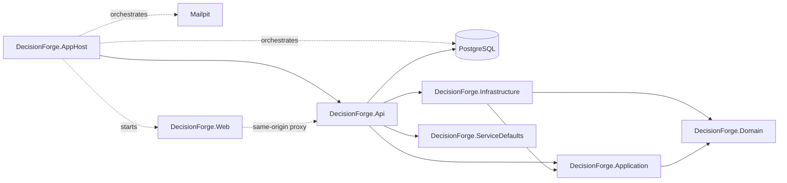

# Component view

## Current Phase 7 structure

DecisionForge remains a modular monolith with one planned deployable host.
Phase 5 adds framework-independent reference aggregates and evaluation facts,
plus application management services and specific persistence/query ports. It
does not add persistence adapters or business API endpoints.

The business dependency rules remain unchanged: Domain references no solution
project; Application references Domain only; Infrastructure references
Application and Domain; API references Application and Infrastructure.
ServiceDefaults is a technical composition dependency containing telemetry,
health, service-discovery and HTTP-resilience registration only.

AppHost waits for PostgreSQL and Mailpit before starting the API, then waits for
the API before starting Vite. The API's readiness check uses real Npgsql
connectivity; liveness is process-only. Architecture tests enforce the complete
project graph, including the AppHost and ServiceDefaults technical edges.

The React project remains a separately built TypeScript workspace. Vite proxies
`/api`, `/health` and `/version` during development, so browser requests stay
same-origin without permissive CORS. Copying production assets into the API host
remains Phase 17 scope.

Within `DecisionForge.Domain`, common primitives support `PurchaseRequest`,
`Department` and `Supplier` aggregates. The domain alone creates immutable
evaluation snapshots from those aggregates and exposes only approved policy
facts. `DecisionForge.Application` owns cancellation-aware management services
and separate department/supplier repository and active-query ports. No generic
repository exists. Infrastructure implementations remain Phase 15 scope.
Architecture tests reject framework dependencies, public entity setters,
forgeable fact records, extra fact paths and incomplete port cancellation.
Phase 7 keeps the strict policy reader, immutable AST, typed fact set,
deterministic evaluator, semantic validator and canonical serializers entirely
inside `DecisionForge.Domain`. The evaluator performs no I/O and has no clock,
randomness, executable expression, scripting, reflection or persistence
dependency. Architecture tests enforce its closed immutable result and trace
surface. See `domain-model.md` for the aggregate boundary and
`policy-contract.md` for the JSON and evaluation contract.
