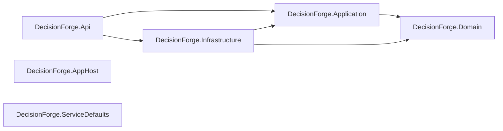

# Component view

## Current Phase 2 structure

DecisionForge is a modular monolith with one planned deployable host. Phase 2
establishes compile-time boundaries only; procurement capabilities begin in
later phases.

`DecisionForge.AppHost` and `DecisionForge.ServiceDefaults` deliberately have
no project references in Phase 2. Phase 3 will configure the Aspire topology and
shared telemetry/health behavior, at which point the architecture policy and
diagram must be updated together.

The production dependency rules are tested from both project files and compiled
assemblies. Domain references no solution project; Application references only
Domain; Infrastructure references Application and Domain; API references
Application and Infrastructure.

The React project is a separately built TypeScript workspace during development.
Copying its production output into the API host is Phase 17 scope and is not
claimed here.
