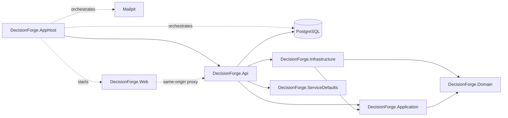

# Component view

## Current Phase 13 structure

DecisionForge remains a modular monolith with one planned deployable host.
Phase 5 adds framework-independent reference aggregates and evaluation facts,
plus application management services and specific persistence/query ports. It
does not add persistence adapters or business API endpoints.

The business dependency rules remain unchanged: Domain references no solution
project; Application references Domain only; Infrastructure references
Application and Domain; API references Application and Infrastructure.
ServiceDefaults is a technical composition dependency containing telemetry,
health, service-discovery and HTTP-resilience registration only.

AppHost waits for PostgreSQL and Mailpit before starting the API, then waits for
the API before starting Vite. The API's readiness check uses real Npgsql
connectivity; liveness is process-only. Architecture tests enforce the complete
project graph, including the AppHost and ServiceDefaults technical edges.

The React project remains a separately built TypeScript workspace. Vite proxies
`/api`, `/health` and `/version` during development, so browser requests stay
same-origin without permissive CORS. Copying production assets into the API host
remains Phase 17 scope.

Within `DecisionForge.Domain`, common primitives support `PurchaseRequest`,
`Department` and `Supplier` aggregates. The domain alone creates immutable
evaluation snapshots from those aggregates and exposes only approved policy
facts. `DecisionForge.Application` owns cancellation-aware management services
and separate department/supplier repository and active-query ports. No generic
repository exists. Infrastructure implementations remain Phase 15 scope.
Architecture tests reject framework dependencies, public entity setters,
forgeable fact records, extra fact paths and incomplete port cancellation.
Phase 7 keeps the strict policy reader, immutable AST, typed fact set,
deterministic evaluator, semantic validator and canonical serializers entirely
inside `DecisionForge.Domain`. The evaluator performs no I/O and has no clock,
randomness, executable expression, scripting, reflection or persistence
dependency. Architecture tests enforce its closed immutable result and trace
surface. See `domain-model.md` for the aggregate boundary and
`policy-contract.md` for the JSON and evaluation contract.

Phase 8 adds the `Policy` aggregate, owned version lifecycle and comparison
logic to Domain. Application contains a concrete lifecycle service, one
specific aggregate repository port, one code-uniqueness query port and a safe
domain-event-to-audit mapping. No persistence adapter or endpoint is introduced.

Phase 9 adds the request application module. Its lifecycle service obtains the
requester only from `ICurrentUserContext`, uses a specific owner-scoped
repository and request-number generator, and delegates all totals/state changes
to the request aggregate. Its query service passes the trusted requester into
bounded projection queries. A separate validator reports submission
preconditions, while a specific idempotency store retains the key, canonical
fingerprint and original request-result reference. These are application ports;
their Identity, EF Core and API adapters remain Phases 13-15 scope. See
`purchase-request-application-lifecycle.md` for the exact trust and transaction
boundaries.

Phase 10 adds immutable `Decision` and owned `RuleEvaluation` evidence to
Domain, plus checksum-valid policy evaluation sources and exact effective-time
selection. A request retains the original policy reference and normalized fact
snapshot used by its first evaluation attempt. Application adds a concrete
decision coordinator/submission service, owner-scoped evidence query and
reproduction service, specific policy/decision ports, and an explicit atomic
decision transaction contract. The evaluator remains pure and the application
still references no EF Core, Npgsql or ASP.NET Core package. See
`decision-orchestration.md` for selection, failure, retry, idempotency and
historical-comparison details.

Phase 11 adds the framework-independent `ApprovalWorkflow` aggregate and its
owned ordered `ApprovalStage` entities. Manual decisions create the workflow in
the same explicit transaction contract as request, decision and idempotency
evidence. Application services obtain actor identity and roles from trusted
ports, enforce resource scope before domain actions, and commit workflow and
request terminal state through one approval-action transaction. Bounded inbox
and detail ports accept only the trusted role scope. Identity handlers, EF Core
adapters and HTTP endpoints remain Phases 13-15. See `approval-workflow.md`.

Phase 12 adds audit, outbox and notification domain types; application event
mapping, delivery ports and a bounded dispatcher; and one Infrastructure
PostgreSQL reliability component plus Mailpit adapter and hosted worker. The
PostgreSQL append joins the caller-owned business transaction. Application
still has no Npgsql or hosting dependency. The worker is disabled by default
until Phase 15 supplies the reviewed migration. See
`audit-outbox-notifications.md` and ADR-0005/0006/0008.

Phase 13 adds an Infrastructure Identity module containing the EF Core Identity
store, controlled role/demo seeders and the application approval-authorization
adapter. API owns the secure cookie and antiforgery configuration, trusted
HTTP-principal adapter, login endpoints and typed resource handlers. Neither
Domain nor Application references ASP.NET Core, Identity or EF Core. The
Identity schema is created only in disposable Phase 13 test databases; Phase
15 remains responsible for the reviewed production migration. See
`identity-and-authorization.md` and ADR-0003.

Phase 14 adds the API-only cross-cutting pipeline: the `/api/v1` group, common
problem/error mapping, bounded allow-listed query parsing, ETag support,
authenticated opt-in idempotency middleware, request/header/CORS/rate safety,
first-party OpenAPI 3.1 and safe CSV encoding. Domain and Application gain no
HTTP dependency. The idempotency store contract is complete, but its durable
PostgreSQL implementation and all business endpoints remain Phase 15. See
`api-foundation.md` and `docs/api/api-guide.md`.
