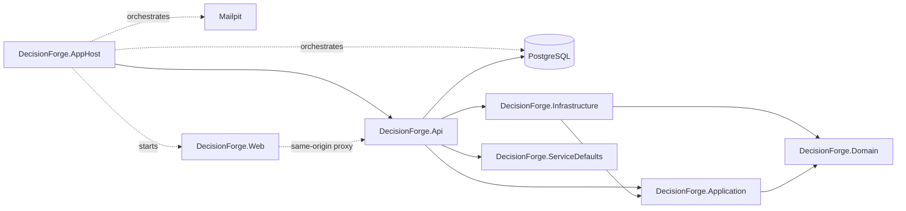

# Component view

## Current Phase 4 structure

DecisionForge remains a modular monolith with one planned deployable host.
Phase 4 adds the framework-independent purchase-request domain without adding
application use cases, persistence mappings or business API endpoints.

The business dependency rules remain unchanged: Domain references no solution
project; Application references Domain only; Infrastructure references
Application and Domain; API references Application and Infrastructure.
ServiceDefaults is a technical composition dependency containing telemetry,
health, service-discovery and HTTP-resilience registration only.

AppHost waits for PostgreSQL and Mailpit before starting the API, then waits for
the API before starting Vite. The API's readiness check uses real Npgsql
connectivity; liveness is process-only. Architecture tests enforce the complete
project graph, including the AppHost and ServiceDefaults technical edges.

The React project remains a separately built TypeScript workspace. Vite proxies
`/api`, `/health` and `/version` during development, so browser requests stay
same-origin without permissive CORS. Copying production assets into the API host
remains Phase 17 scope.

Within `DecisionForge.Domain`, common entity/aggregate/event primitives support
immutable value objects and the `PurchaseRequest` aggregate. The aggregate owns
its items, state transitions and authoritative total. Architecture tests reject
framework dependencies, public entity setters and test-only internal access.
See `domain-model.md` for the implemented domain boundary.
