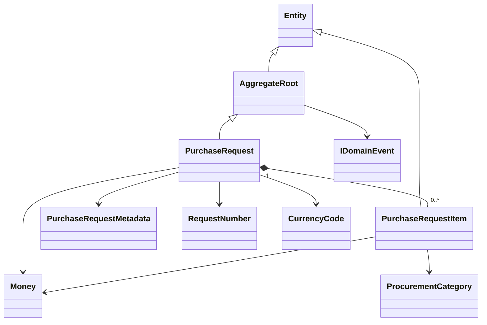
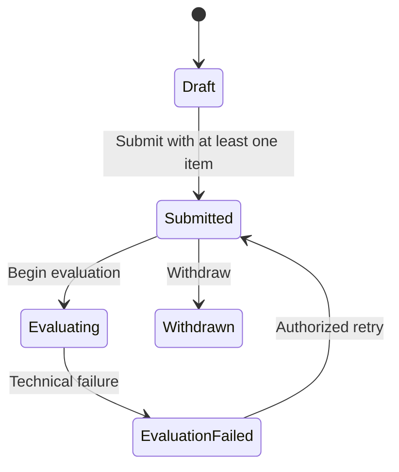

# Domain model

## Phase 4 boundary

`DecisionForge.Domain` contains procurement state and rules only. It references
no other solution project and has no ASP.NET Core, EF Core, Npgsql or dependency
injection dependency. Application use cases, reference-data entities, policy
evaluation, persistence and API contracts belong to later phases.

## Request aggregate

A new request receives its UUID, human-readable request number, requester UUID,
currency and UTC creation time from its caller. This makes construction
deterministic and avoids hidden clock or identifier generation. The requester
is immutable ownership data. A new request is a `Draft`, has no items, has a
zero total in its declared currency and raises one creation event.

Only the aggregate adds, changes or removes owned items. Item quantities and
unit prices must be positive, descriptions are bounded, categories are
controlled enums and line totals must fit PostgreSQL `numeric(18,2)`. Item
currency must equal request currency. The request never accepts a client total;
it recalculates the total from line totals after every successful mutation.
Overflow and validation failures are checked before state changes, preventing a
failed operation from partially mutating the aggregate.

Metadata consists of non-empty department and supplier UUIDs, urgency, data
sensitivity, expected delivery date and an optional bounded business
justification. Metadata and items are immutable once the request leaves Draft.

## Implemented transitions

Every operation checks its allowed source state. Repeated submission,
withdrawal, evaluation start or retry is rejected with
`domain.invalid-state`. Withdrawal from `PendingApproval` is recognized by the
aggregate contract, while creation of approval state remains Phase 10/11 scope.
All mutation timestamps must be UTC and cannot precede the aggregate's previous
change.

## Domain events

Creation, metadata changes, item addition/change/removal, submission,
evaluation start/failure/retry and withdrawal raise distinct immutable events.
Events contain identifiers and controlled values needed by later application
and audit mapping; business justification and item description text are not
copied into events.

## Value objects and errors

The required value objects are immutable and construction-validated:
`Money`, `CurrencyCode`, `RequestNumber`, `PolicyVersionNumber`,
`PolicyChecksum`, `ReasonCode`, `DepartmentCode`,
`SupplierRegistrationNumber`, `BusinessJustification`, `CorrelationId`,
`IdempotencyKey`, `ConcurrencyToken` and `AuditHash`.

`Money` is non-negative, has at most two decimal places, is bounded to
`numeric(18,2)`, and rejects mixed-currency or overflowing arithmetic. Domain
failures expose stable codes for validation, invalid state, missing/duplicate
entities, currency mismatch and amount overflow.
