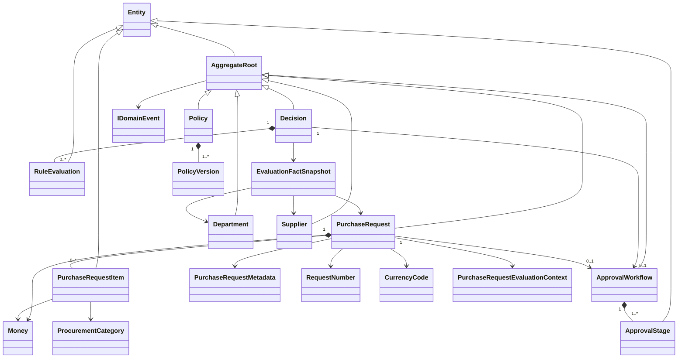
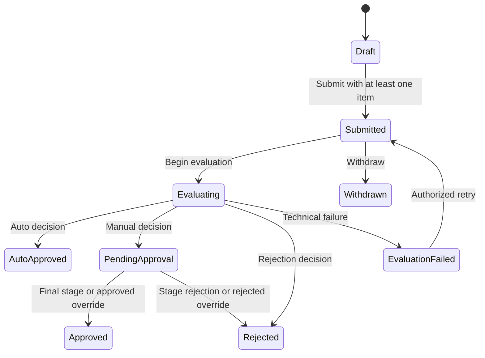

# Domain model

## Phase 12 boundary

`DecisionForge.Domain` contains procurement state and rules only. It references
no other solution project and has no ASP.NET Core, EF Core, Npgsql or dependency
injection dependency. Phase 5 adds reference-data aggregates and the policy-fact
boundary. Phase 6 adds strict policy parsing, an immutable policy AST,
validation and canonical policy checksums. Phase 7 adds typed facts, a pure
deterministic evaluator, immutable explanation traces and result checksums.
Phase 8 adds aggregate-owned policy versioning, optimistic concurrency,
immutable publication, half-open effective ranges, retirement and structured
comparison. Phase 9 adds request concurrency and domain-owned cloning plus the
application lifecycle boundary. Phase 10 adds policy selection, immutable
decision evidence and request-owned retry context. Phase 11 adds ordered
approval state, role-matched actions, concurrency rotation and terminal request
outcomes. Persistence and API contracts remain later phases.

## Policy lifecycle

`Policy` has an immutable normalized code and bounded name, a concurrency token
and one or more owned versions. Creation produces version 1 in Draft. At most
one draft exists; each later draft receives the previous maximum number plus
one under the aggregate token. Successful lifecycle mutations rotate the token.

Draft JSON is retained exactly while strict parsing and semantic validation
produce normalized errors. Only a valid definition receives its canonical
SHA-256 checksum. Publication freezes definition/checksum and assigns a UTC
half-open effective range. Published and retired versions are immutable;
retirement preserves history and closes an open range. See
`policy-lifecycle.md` for boundaries and structured comparison behavior.

## Reference data

`Department` has an immutable normalized code, bounded name, non-negative money
threshold, active flag and optimistic concurrency token. `Supplier` has an
immutable normalized registration number, bounded name, controlled approval,
onboarding and risk states, active flag and concurrency token. Onboarding is
modeled independently from approval using `NotStarted`, `InProgress`,
`Completed` and `Suspended`, so a suspended onboarding condition is not
conflated with the supplier's commercial approval state.

Creation is active by default. Detail and activation mutations require the
current token, a distinct caller-supplied next token and a monotonic UTC time.
Stale tokens return `domain.concurrency-conflict`; repeating the current active
state returns `domain.invalid-state`. Codes and registration numbers cannot be
changed. Application services use injected `TimeProvider` and `IIdGenerator`
and persist only successful state changes.

## Evaluation facts

`EvaluationFactSnapshot.Create` is the sole public construction path. It joins
a request to matching active reference aggregates, rejects currency mismatch,
past delivery dates, missing items and item-count overflow, then copies exactly
the approved request, department, supplier and derived fact paths. Fact records
have no public constructors or setters, preventing policy consumers from
forging or mutating inputs.

Technology is derived from software, hardware or cloud-service line items.
Urgency exception is derived from urgent or emergency requests. A request with
one line category exposes that category; a mixed-category request exposes the
controlled `Other` category while technology remains independently derived.

## Request aggregate

A new request receives its UUID, human-readable request number, requester UUID,
currency, concurrency token and UTC creation time from its caller. This makes
construction deterministic and avoids hidden clock or identifier generation.
The requester is immutable ownership data. A new request is a `Draft`, has no
items, has a zero total in its declared currency and raises one creation event.

Only the aggregate adds, changes or removes owned items. Item quantities and
unit prices must be positive, descriptions are bounded, categories are
controlled enums and line totals must fit PostgreSQL `numeric(18,2)`. Item
currency must equal request currency. The request never accepts a client total;
it recalculates the total from line totals after every successful mutation.
Overflow and validation failures are checked before state changes, preventing a
failed operation from partially mutating the aggregate.

Metadata consists of non-empty department and supplier UUIDs, urgency, data
sensitivity, expected delivery date and an optional bounded business
justification. Metadata and items are immutable once the request leaves Draft.
Every successful request mutation replaces the application-managed token;
stale or reused tokens fail atomically. No-op edits preserve the current token.

Cloning is a domain operation over an owned source. It copies currency,
metadata and item values into a new Draft while assigning a new request number,
aggregate UUID, item UUIDs and concurrency token. The total is recomputed from
the copied line values. Source state and events remain unchanged, and the clone
records its source using a controlled event.

## Implemented transitions

Every operation checks its allowed source state. Repeated submission,
withdrawal, evaluation start or retry is rejected with
`domain.invalid-state`. Withdrawal from `PendingApproval` is recognized by the
request aggregate; persistence-level workflow cancellation coordination is part
of the later business transaction adapter.
All mutation timestamps must be UTC and cannot precede the aggregate's previous
change. Evaluation start captures an immutable policy reference and normalized
fact snapshot. A failed evaluation retains this context; retry rejects any
changed policy identity, checksum or normalized input.

## Decision aggregate

`Decision` records one authoritative evaluator result for a purchase request.
It copies exact policy/version/checksum identity, normalized inputs, final
disposition, ordered approver roles, de-duplicated reasons, input and trace
checksums and one immutable `RuleEvaluation` per policy rule. Rule evidence
retains priority, match state, complete condition/fact-access trace and the
controlled matched outcome. Neither aggregate nor owned evidence exposes a
public constructor or setter.

The application state machine prevents a second non-replay decision. Phase 15
must reinforce the invariant with a unique database constraint on purchase
request identity. Historical reproduction evaluates stored facts with the
exact recorded version and compares results without mutating this aggregate.

## Approval workflow aggregate

Only a `ManualApprovalRequired` decision with at least one required role can
create an approval workflow. The plan uses the same canonical role order as the
policy evaluator, removes duplicates, assigns immutable one-based sequence
numbers and begins with exactly one `Pending` stage. Later stages are `Waiting`.

Only the pending stage can be acted on and its actor role must match the stage
role. Approval records actor, optional bounded note, UTC time and a distinct
token, then activates at most one next stage. Activation also rotates the next
stage token so a token observed while it was waiting cannot authorize a later
action. Rejection requires a non-empty bounded reason, rejects the current
stage, skips all future stages and terminates the workflow. Final approval or
any rejection transitions the request from `PendingApproval` in the same
application transaction boundary.

An override is allowed by the application only after the trusted authorization
port grants explicit permission. It requires a fresh current-stage token and a
reason, cancels remaining actionable stages, records actor/time/target outcome,
and leaves the immutable original decision disposition as
`ManualApprovalRequired`. The override raises a dedicated audit-source event;
audit-chain persistence is Phase 12 scope.

## Domain events

Creation, cloning, metadata changes, item addition/change/removal, submission,
evaluation start/failure/retry, approval completion and withdrawal raise
distinct immutable events. Workflow creation, activation, approval, rejection,
completion and override also raise distinct immutable events.
Events contain identifiers and controlled values needed by later application
and audit mapping; business justification and item description text are not
copied into events. Phase 12 maps every current event to a controlled audit
event and outbox envelope. Approval rejection and override text stays on the
workflow; audit/outbox payloads retain only presence, length and SHA-256
evidence.

## Reliability entities

`AuditEvent` is append-only application evidence with a positive per-aggregate
sequence, safe canonical payload, previous hash and calculated hash.
`AuditChainVerifier` detects sequence gaps, link changes and payload/hash edits,
returning the first invalid expected sequence. `OutboxMessage` controls pending,
processing, completed and terminal-failed transitions with bounded attempts.
`Notification` owns a stable source outbox ID and an idempotent read transition;
links must be application-relative.

## Value objects and errors

The required value objects are immutable and construction-validated:
`Money`, `CurrencyCode`, `RequestNumber`, `PolicyVersionNumber`,
`PolicyChecksum`, `ReasonCode`, `DepartmentCode`,
`SupplierRegistrationNumber`, `BusinessJustification`, `CorrelationId`,
`IdempotencyKey`, `ConcurrencyToken` and `AuditHash`.

`Money` is non-negative, has at most two decimal places, is bounded to
`numeric(18,2)`, and rejects mixed-currency or overflowing arithmetic. Domain
failures expose stable codes for validation, invalid state, missing/duplicate
entities, currency mismatch, amount overflow, optimistic-concurrency conflict,
inactive reference and reference mismatch.
