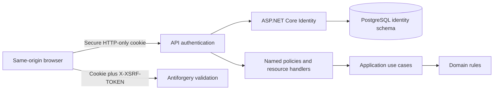

# Identity and resource authorization

## Trust boundaries

ASP.NET Core Identity persists users, roles, password hashes, lockout state and
claims in the `identity` PostgreSQL schema. `DecisionForgeIdentityDbContext` is
an Infrastructure adapter. The API converts only the authenticated
`NameIdentifier` claim into `ICurrentUserContext.UserId`; application commands
never accept a requester or actor identity from their request contract.

The authentication cookie is `__Host-DecisionForge-Auth`, HTTP-only, Secure,
SameSite Strict, essential, path `/`, non-sliding and limited to eight hours.
API authentication failures are status responses rather than redirects.

## Roles and explicit permission

The idempotent role catalog contains Requester, the five ordered approver
roles, PolicyAuthor, PolicyPublisher, Auditor and Administrator. Administrator
does not inherit approval, audit or override authority. Override uses the
explicit `decisionforge.permission=decision.override` claim; the demo senior
approver receives that claim deliberately.

Demo users are all `@decisionforge.local` aliases. They are created only when
`DecisionForge:Identity:Seeding:Demo:Enabled` is true, the environment is
Development or Demo, and a strong password is supplied by configuration. A
pre-existing non-demo account with a demo alias causes a controlled failure
instead of receiving roles.

## Authorization matrix

| Policy | Allowed scope |
|---|---|
| `CanCreateRequest` | Requester role |
| `CanReadPurchaseRequest` | Requester owner, role assigned to an existing stage, or Auditor |
| `CanEditPurchaseRequest` | Requester owner and draft state |
| `CanSubmitPurchaseRequest` | Requester owner and draft state |
| `CanActOnApprovalStage` | Matching required role and pending state |
| `CanAuthorPolicy` | PolicyAuthor |
| `CanPublishPolicy` | PolicyPublisher |
| `CanReadAudit` | Auditor |
| `CanManageReferenceData` | Administrator |
| `CanOverrideDecision` | Explicit override permission claim |

Resource projections are constructed from server-loaded state. A client ID,
role, owner or status value is not an authorization assertion. Business API
endpoints that load and apply these policies remain Phase 15 scope.

## Antiforgery and abuse control

`GET /api/v1/auth/antiforgery` sets an HTTP-only, Secure, SameSite Strict
antiforgery cookie and returns the request token and required header name.
Login and logout require the header; missing or mismatched tokens return a
controlled 400 response. Login also uses a bounded IP-partitioned rate limiter.
Identity locks new accounts for 15 minutes after five failed password attempts.

Production never calls `EnsureCreated` or runs a migration at startup. Phase 13
tests create the schema only in disposable PostgreSQL 18.4 containers. Phase 15
owns the reviewed production migration.
