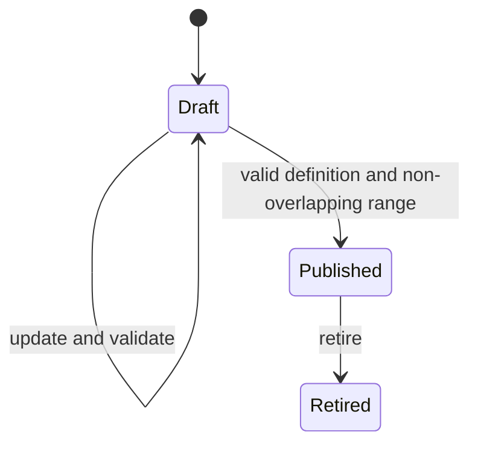

# Policy lifecycle and versioning

## Aggregate boundary

`Policy` is the aggregate root. Its immutable code and name identify a sequence
of owned `PolicyVersion` entities. The aggregate exposes a read-only version
collection and one application-managed concurrency token. Every successful
draft creation, draft update, publication or retirement rotates that token.

Creation produces version 1 in `Draft`. After a version leaves Draft, a new
draft receives the preceding maximum version plus one. At most one draft may
exist for a policy, preventing two competing next versions. The later
persistence phase must add unique policy-code and policy/version constraints;
the aggregate and optimistic token enforce the same rules before persistence.



Published and retired definitions cannot transition back to Draft and cannot
be edited or republished.

## Draft validation and checksums

Drafts preserve the submitted JSON exactly, including malformed input, so an
editor can display and correct it. Strict Phase 6 parsing and semantic
validation run on creation and every update. The policy code and name in a
valid document must match its aggregate identity.

An invalid draft exposes normalized validation errors and has neither a parsed
definition nor a checksum. A valid draft stores the immutable parsed contract
and SHA-256 checksum of its canonical JSON. Semantically equivalent supported
JSON therefore refreshes to the same checksum. Publication rechecks that the
draft is valid.

## Effective ranges and retirement

Effective ranges are half-open UTC intervals:

```text
[effectiveFrom, effectiveUntil)
```

The start is inclusive. A non-null end must be later than the start. Adjacent
ranges, where one end equals another start, do not overlap. An open end extends
indefinitely. Publication rejects overlap with every published or retired
historical range in the same policy. Effective starts cannot be backdated
before publication.

Retirement changes `Published` to `Retired` and closes an open range at the UTC
retirement time. An already bounded earlier end is preserved. Retired versions
remain queryable and continue participating in historical overlap checks.

## Structured comparison

Only valid versions can be compared. The result contains ordered added and
removed rule IDs, modified rules with separate priority/condition/outcome
flags, and a default-outcome change flag. Canonical condition and outcome
fragments prevent reference identity or culture from affecting comparisons.

## Application boundary and audit data

`IPolicyRepository` loads/adds policy aggregates and commits changes;
`IPolicyQueries` performs policy-code uniqueness checks. Both are specific,
non-generic and require cancellation on every operation. The lifecycle service
uses injected `TimeProvider` and ID generation for deterministic UTC time,
entity IDs and concurrency tokens.

Lifecycle events map to controlled audit event types and safe scalar fields:
policy/version IDs, number, validation state, checksum and effective dates.
Full definition JSON and policy free text are excluded. Canonical audit storage
and hash chaining remain Phase 12 scope.
