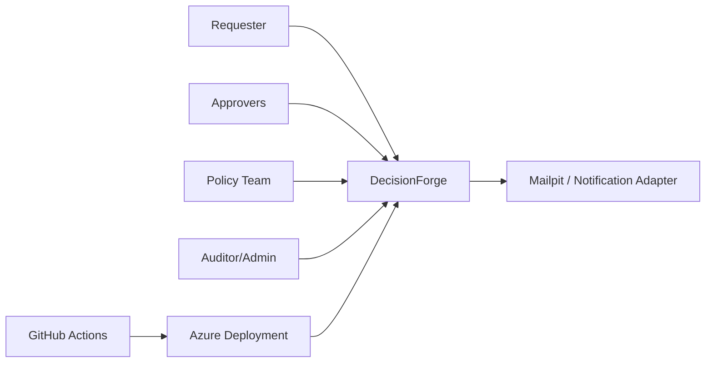
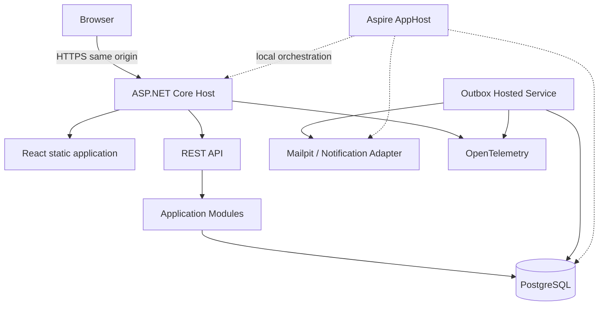
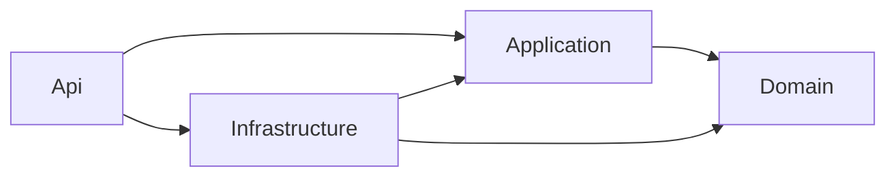
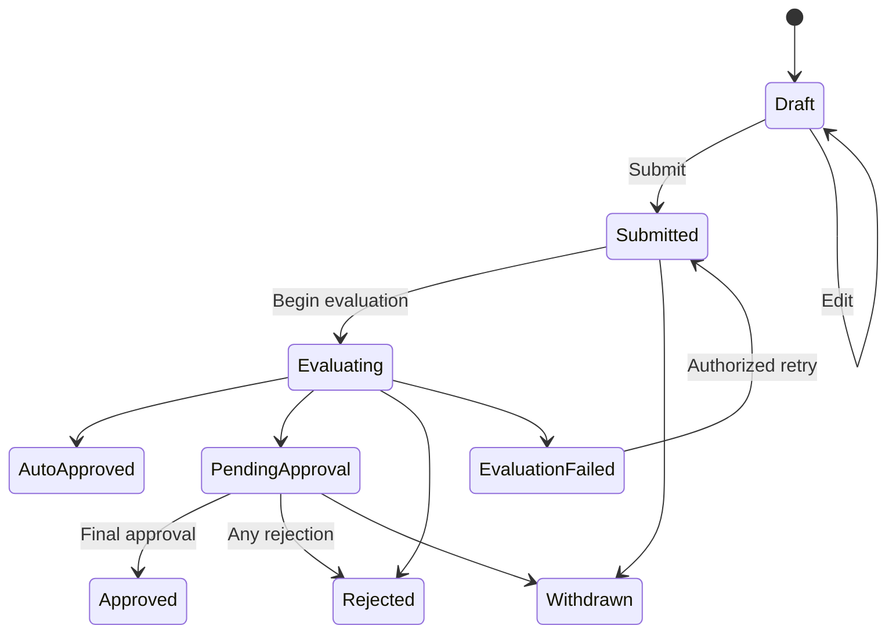
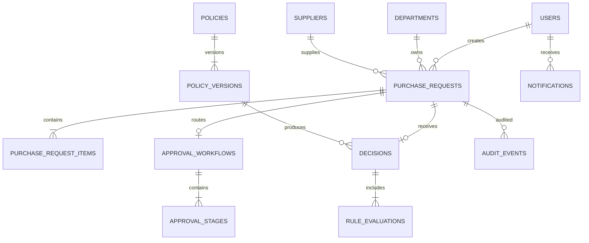
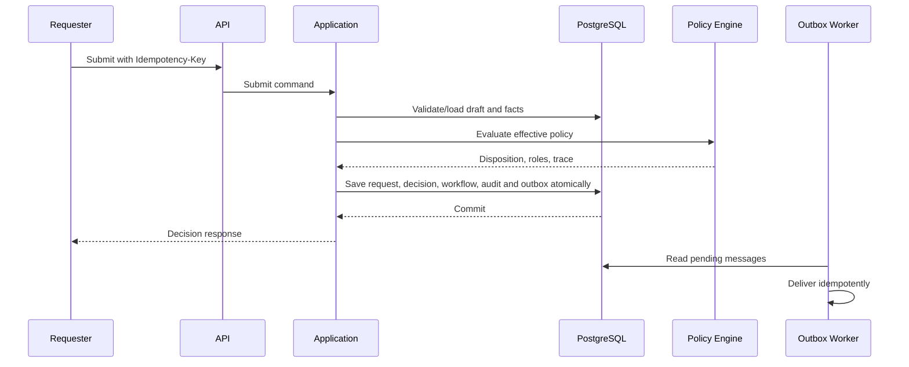
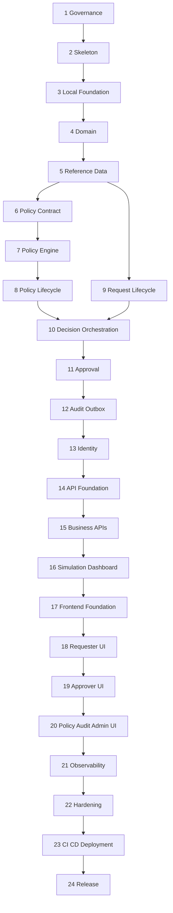

# DecisionForge
## Explainable Procurement Decision and Approval Platform
### End-to-End Implementation Specification and Atomic Task Graph

| Document field | Value |
|---|---|
| Document type | Executable engineering specification |
| Version | 1.0 |
| Status | Approved implementation baseline |
| Prepared for | One implementer using Codex or another coding agent |
| Primary stack | C#/.NET 10, ASP.NET Core, EF Core 10, PostgreSQL 18, React 19, TypeScript, Vite 8 |
| Last updated | 2026-07-31 |
| Repository document name | `spec.md` |

---

# 1. Purpose

This document is the single source of truth for designing, implementing, testing, securing, observing, packaging, deploying and demonstrating DecisionForge. The code will be assessed not only for visible functionality, but also for correctness, architecture, maintainability, tests, security, reliability, performance, accessibility, observability, documentation and reproducibility.

The project is complete only when the end-to-end workflow functions and every mandatory quality gate in this specification passes. This specification is organized as an **Atomic Task Graph (ATG)** so an implementation agent can execute one phase at a time without inventing missing scope.

# 2. Mandatory execution protocol

When instructed to run a phase, the coding agent shall:

1. Read this entire file before editing code.
2. Inspect all existing files relevant to the requested phase.
3. Run the prerequisite checks before implementation.
4. Implement only the requested phase and the minimum compile-safe dependencies it explicitly requires.
5. Never add fake data paths, placeholder success responses, disabled tests or silent exception handling.
6. Never weaken analyzers, tests, authorization or security controls merely to make a gate pass.
7. Update code, tests, API contracts, diagrams and documentation together.
8. Run every phase-gate command that applies.
9. Report exact commands and actual results.
10. Stop and report a blocker when a mandatory acceptance criterion cannot be met.

## 2.1 Required completion report

```text
PHASE COMPLETION REPORT
Phase:
Status: PASS | PARTIAL | BLOCKED
Implemented task IDs:
Files created:
Files modified:
Design decisions:
Validation commands and results:
Test summary:
Coverage summary:
Security or quality findings:
Specification deviations:
Known issues:
Next eligible phase:
```

## 2.2 Prohibited shortcuts

- No microservices, Kafka, Kubernetes, event sourcing or multiple databases.
- No arbitrary executable rule expressions, `eval`, runtime compilation, scripts or SQL inside policies.
- No business logic in controllers or React components.
- No generic repository shared by every entity.
- No browser authentication token in local storage.
- No raw EF entity returned as an API contract.
- No `.Result`, `.Wait()`, `async void`, empty `catch`, service locator or hidden global state.
- No direct `DateTime.Now`, `DateTime.UtcNow` or widespread `Guid.NewGuid()` in domain/application logic.
- No in-memory database as the only integration-test database.
- No tests that only assert status codes or mirror the production algorithm.
- No warning suppression without a narrow documented justification.
- No unbounded list endpoints.
- No logging of passwords, cookies, authorization headers, antiforgery tokens, complete policy JSON or full sensitive free text.
- No fabricated KPI, coverage, performance or security evidence.

---

# 3. Product definition

## 3.1 Product statement

DecisionForge is an explainable procurement decision and approval platform. A requester submits a purchase request; the platform evaluates it against a controlled, versioned policy; produces an `AutoApproved`, `ManualApprovalRequired` or `Rejected` disposition; explains every matched rule; and, when required, creates an ordered approval workflow.

Every decision shall be deterministic, linked to the exact policy version and checksum, reproducible later, audited, concurrency-safe and protected through role- and resource-level authorization.

## 3.2 Recruiter-facing statement

> Every procurement decision can be explained, audited and reproduced using the exact policy version that generated it.

## 3.3 Flagship scenario

A requester submits a purchase of 30 laptops worth INR 2,400,000 from a newly registered supplier for an urgent customer project. Seeded policy rules shall require procurement, information-security, finance and senior-management approvals and shall explain each requirement. This result must come from policy data and domain logic, not hard-coded endpoint or UI behaviour.

# 4. Goals and non-goals

## 4.1 Goals

| ID | Goal |
|---|---|
| G-01 | Complete requester-to-decision-to-approval workflow. |
| G-02 | Custom safe deterministic policy evaluator. |
| G-03 | Immutable published policy versions with SHA-256 checksums. |
| G-04 | Persisted rule-by-rule decision evidence. |
| G-05 | Historical reproduction without overwriting original decisions. |
| G-06 | Draft-policy simulation against seeded or historical inputs. |
| G-07 | Server-side role and resource authorization. |
| G-08 | Tamper-evident application audit chain. |
| G-09 | Unit, property, integration, architecture, mutation, security, E2E, accessibility and performance tests. |
| G-10 | Structured logs, traces, metrics and health checks. |
| G-11 | One-command local execution and automated deployment artefacts. |
| G-12 | Recruiter-ready README, diagrams, demo and KPI evidence. |

## 4.2 Non-goals

| ID | Non-goal |
|---|---|
| NG-01 | Generic programming language or no-code visual designer. |
| NG-02 | Real ERP, payment, supplier or corporate directory integration. |
| NG-03 | Multi-tenancy. |
| NG-04 | AI-generated procurement decisions. |
| NG-05 | Complex delegation, leave calendars or substitute approvers. |
| NG-06 | Production mail delivery; Mailpit plus an adapter is sufficient. |
| NG-07 | Legal or regulatory certification claims. |

# 5. Personas and roles

| Persona / role | Permitted responsibility |
|---|---|
| `Requester` | Create, edit, submit, view, withdraw and clone own requests. |
| `DepartmentApprover` | Act on assigned department stage. |
| `ProcurementApprover` | Review supplier and procurement exceptions. |
| `SecurityApprover` | Review technology or data-sensitive purchases. |
| `FinanceApprover` | Review financial thresholds. |
| `SeniorApprover` | Review very high-value requests. |
| `PolicyAuthor` | Create and edit draft versions and run validation/simulation. |
| `PolicyPublisher` | Publish or retire validated versions. |
| `Auditor` | Read decisions and audit events and verify chains. |
| `Administrator` | Manage reference data and demo identities; no implicit approval authority. |

Resource rules:

- Requesters see only their own requests.
- Approvers see a request only when a stage assigned to one of their roles exists.
- Only the currently pending stage can be acted upon.
- Policy authors cannot publish unless they also hold `PolicyPublisher`.
- Published versions cannot be edited by any role.
- Auditors are read-only.
- Administrators do not automatically receive approver privileges.
- Every denial path shall have an automated test.

# 6. Functional requirements

## 6.1 Identity

| ID | Requirement |
|---|---|
| FR-AUTH-01 | ASP.NET Core Identity local accounts for demo implementation. |
| FR-AUTH-02 | Secure HTTP-only cookie authentication; no local-storage token. |
| FR-AUTH-03 | Antiforgery protection for browser state-changing requests. |
| FR-AUTH-04 | `me`, login and logout endpoints. |
| FR-AUTH-05 | Demo users seeded only when an explicit demo setting is enabled. |
| FR-AUTH-06 | Demo password supplied by configuration and never as a production secret. |

## 6.2 Reference data

| ID | Requirement |
|---|---|
| FR-REF-01 | Manage departments with unique code, active state and auto-approval limit. |
| FR-REF-02 | Manage suppliers with unique registration number, approval status, onboarding status, risk and active state. |
| FR-REF-03 | Inactive records remain available to history but cannot be selected for new requests. |
| FR-REF-04 | Reference-data changes are audited and concurrency protected. |

## 6.3 Purchase requests

| ID | Requirement |
|---|---|
| FR-REQ-01 | Create and edit requester-owned drafts. |
| FR-REQ-02 | A draft needs at least one item before submission. |
| FR-REQ-03 | Server calculates totals from quantity and unit price. |
| FR-REQ-04 | Submitted requests are immutable. |
| FR-REQ-05 | Non-terminal submitted requests may be withdrawn. |
| FR-REQ-06 | Existing requests may be cloned into a new draft. |
| FR-REQ-07 | Human-readable unique request number. |
| FR-REQ-08 | Submission is idempotent. |
| FR-REQ-09 | Updates and actions detect stale concurrency tokens. |
| FR-REQ-10 | Missing or inactive reference data fails safely. |

## 6.4 Policies and decisions

| ID | Requirement |
|---|---|
| FR-POL-01 | Create policy and draft versions. |
| FR-POL-02 | Strict controlled JSON contract with structural and semantic validation. |
| FR-POL-03 | Invalid draft cannot publish. |
| FR-POL-04 | Published version is immutable and checksum protected. |
| FR-POL-05 | Effective ranges for one policy cannot overlap. |
| FR-POL-06 | One applicable published policy selected by submission timestamp. |
| FR-POL-07 | Structured comparison between versions. |
| FR-DEC-01 | Deterministic evaluation for identical normalized inputs and version. |
| FR-DEC-02 | Every rule produces an evaluation trace. |
| FR-DEC-03 | Disposition precedence: Rejected > ManualApprovalRequired > AutoApproved. |
| FR-DEC-04 | Required approver roles are de-duplicated and ordered. |
| FR-DEC-05 | Missing facts never silently auto-approve. |
| FR-DEC-06 | Store policy ID, version, checksum, normalized facts and trace. |
| FR-DEC-07 | Historical reproduction compares without modifying original history. |

## 6.5 Approvals, simulation and audit

| ID | Requirement |
|---|---|
| FR-APR-01 | Manual decision creates ordered stages. |
| FR-APR-02 | Authorized approver can approve or reject current stage. |
| FR-APR-03 | Rejection reason mandatory. |
| FR-APR-04 | Rejection terminates workflow; final approval approves request. |
| FR-APR-05 | Repeated or concurrent actions cannot duplicate outcomes. |
| FR-APR-06 | Override requires explicit permission, reason and preserved original outcome. |
| FR-SIM-01 | Simulate validated draft against immutable input set. |
| FR-SIM-02 | Simulation never mutates real requests or workflows. |
| FR-SIM-03 | Report changed disposition, roles and reason-code impact. |
| FR-AUD-01 | Significant business changes append audit events in same transaction. |
| FR-AUD-02 | Audit events are not updateable or deleteable through APIs. |
| FR-AUD-03 | Per-aggregate SHA-256 hash chain is verifiable. |
| FR-AUD-04 | Audit payload excludes secrets and unnecessary sensitive text. |

# 7. Non-functional requirements

| Area | Mandatory requirement |
|---|---|
| Maintainability | Nullable C#, strict TypeScript, warnings as errors, architecture tests, central package versions and lock files. |
| Reliability | Atomic transactions, transactional outbox, idempotent handlers, bounded retries and optimistic concurrency. |
| Security | Deny-by-default authorization, antiforgery, rate limits, safe errors, restrictive CORS, secure headers and supply-chain scans. |
| Performance | 100-rule evaluator p95 < 50 ms; normal read p95 < 300 ms at 20 RPS; submit/evaluate/persist p95 < 750 ms at 10 RPS. |
| Database | Server pagination, max page size 100, no N+1 query patterns and dashboard < 2 seconds for 10,000 seeded requests. |
| Observability | Correlated structured logs, OpenTelemetry traces/metrics, custom business spans and separate live/ready health. |
| Accessibility | Keyboard operation, labels, non-colour status cues and zero serious/critical automated violations on required pages. |
| Portability | One-command local start and production container runnable as non-root. |

# 8. Approved technology baseline

| Layer | Technology |
|---|---|
| Runtime | .NET 10 LTS, latest 10.0.x security patch |
| Backend | ASP.NET Core Web API |
| Persistence | EF Core 10 and Npgsql |
| Database | PostgreSQL 18 current supported minor |
| Authentication | ASP.NET Core Identity secure cookie |
| Orchestration | Stable Aspire compatible with .NET 10 |
| Frontend | Node.js 24 LTS, React 19 stable, TypeScript, Vite 8 |
| UI | One pinned accessible component library, recommended Material UI |
| Client data/forms | TanStack Query, React Hook Form, Zod |
| Backend tests | xUnit, FsCheck, NSubstitute only where justified |
| Integration | Testcontainers for .NET and PostgreSQL |
| Architecture | NetArchTest or equivalent |
| Mutation | Stryker.NET |
| Frontend tests | Vitest, Testing Library, Playwright and axe-core |
| Performance | BenchmarkDotNet and k6 |
| Telemetry | Serilog and OpenTelemetry |
| Local mail | Mailpit behind `INotificationSender` |
| CI/CD | GitHub Actions, CodeQL, Dependabot, dependency review, container scan |
| Deployment | Azure Container Apps and Azure Database for PostgreSQL Flexible Server using Bicep |

Package rules: central NuGet versions, `packages.lock.json`, committed npm lock file, no wildcards, no prerelease packages without ADR, and final GitHub Actions pinned to immutable SHAs.

# 9. Architecture

## 9.1 Principles

1. Modular monolith and one deployable application.
2. Domain and application layers independent of ASP.NET Core, EF and UI.
3. Deterministic policy evaluator isolated from I/O.
4. Specific repositories/query ports rather than generic repository.
5. Same-origin React and API in production for secure cookie authentication.
6. Business state, audit and outbox committed atomically.
7. Documentation must match code.

## 9.2 System context



## 9.3 Runtime containers



Local development may run Vite separately with an API proxy. Production shall build React and copy it into the ASP.NET Core `wwwroot`, producing one application container.

## 9.4 Backend dependency graph



Rules:

- Domain references no solution project.
- Application references Domain only.
- Infrastructure references Application and Domain.
- API references Application and Infrastructure.
- Architecture tests enforce the graph.

# 10. Repository structure

```text
DecisionForge/
├── DecisionForge.sln
├── global.json
├── Directory.Build.props
├── Directory.Packages.props
├── .editorconfig
├── README.md
├── spec.md
├── src/
│   ├── DecisionForge.Domain/
│   ├── DecisionForge.Application/
│   ├── DecisionForge.Infrastructure/
│   ├── DecisionForge.Api/
│   ├── DecisionForge.AppHost/
│   ├── DecisionForge.ServiceDefaults/
│   └── DecisionForge.Web/
├── tests/
│   ├── DecisionForge.Domain.UnitTests/
│   ├── DecisionForge.Application.UnitTests/
│   ├── DecisionForge.Infrastructure.IntegrationTests/
│   ├── DecisionForge.Api.IntegrationTests/
│   ├── DecisionForge.ArchitectureTests/
│   ├── DecisionForge.ContractTests/
│   ├── DecisionForge.PerformanceTests/
│   └── DecisionForge.Testing/
├── performance/k6/
├── deploy/docker/
├── deploy/azure/
├── docs/architecture/
├── docs/adr/
├── docs/api/
├── docs/testing/
├── docs/security/
├── docs/operations/
├── docs/demo/
├── docs/evidence/
├── scripts/
└── .github/
```

# 11. Domain model

## 11.1 Aggregates and entities

| Type | Responsibility |
|---|---|
| `PurchaseRequest` | Draft editing, submission, withdrawal, terminal state and item ownership. |
| `PurchaseRequestItem` | Quantity, unit price, category and line-total calculation. |
| `Policy` | Policy identity and version lifecycle. |
| `PolicyVersion` | Draft or immutable published definition, effective range and checksum. |
| `Decision` | Final disposition, normalized input, policy evidence and trace. |
| `RuleEvaluation` | Result of one policy rule. |
| `ApprovalWorkflow` | Ordered stages and completion rules. |
| `ApprovalStage` | Required role, state, actor, note and concurrency. |
| `Department` | Department code, name, active state and threshold. |
| `Supplier` | Registration, onboarding, approval, risk and active state. |
| `AuditEvent` | Append-only tamper-evident event. |
| `OutboxMessage` | Durable asynchronous message. |
| `Notification` | In-application user notification. |
| `IdempotencyRecord` | Operation key, fingerprint and original result reference. |

Required value objects: `Money`, `CurrencyCode`, `RequestNumber`, `PolicyVersionNumber`, `PolicyChecksum`, `ReasonCode`, `DepartmentCode`, `SupplierRegistrationNumber`, `BusinessJustification`, `CorrelationId`, `IdempotencyKey`, `ConcurrencyToken` and `AuditHash`.

Value objects shall be immutable, validate construction, provide value equality and have focused tests and EF converters when required.

## 11.2 Enums

```text
PurchaseRequestStatus: Draft, Submitted, Evaluating, AutoApproved, PendingApproval, Approved, Rejected, Withdrawn, EvaluationFailed
PolicyStatus: Draft, Published, Retired
DecisionDisposition: AutoApproved, ManualApprovalRequired, Rejected
ApprovalStageStatus: Waiting, Pending, Approved, Rejected, Skipped, Cancelled
ProcurementCategory: OfficeSupplies, ProfessionalServices, Software, Hardware, CloudService, Travel, Facilities, Other
Urgency: Normal, Urgent, Emergency
DataSensitivity: Public, Internal, Confidential, Restricted
SupplierApprovalStatus: Pending, Approved, Suspended, Rejected
SupplierRiskRating: Low, Medium, High, Critical
```

## 11.3 Request state machine



## 11.4 Invariants

Purchase request:

- belongs to exactly one requester;
- contains at least one item before submission;
- quantity and unit price are positive;
- server total equals sum of line totals;
- submitted request cannot be edited;
- terminal request cannot be withdrawn;
- at most one authoritative decision;
- every significant transition raises a domain event.

Policy:

- versions increase monotonically;
- published version is immutable;
- retired version remains queryable;
- effective ranges do not overlap;
- publish requires zero validation errors;
- checksum derives from canonical JSON;
- rule IDs are unique;
- fact, operator, outcome and role are controlled.

Approval:

- stages unique by role;
- exactly one pending stage in version 1;
- action records actor, timestamp, note and new concurrency token;
- rejection terminates workflow;
- completed stage cannot be acted on again.

# 12. Persistence design

- UUID application-generated primary keys.
- UTC `timestamp with time zone`.
- `numeric(18,2)` for money and ISO currency code.
- Foreign keys for all relationships.
- Restrictive delete behaviour for historical data.
- No cascade deletion of policies, decisions, approvals or audit.
- Unique constraints for request number, department code, supplier registration, policy/version and idempotency scope/key.
- Application-managed GUID concurrency token surfaced as ETag.
- Migrations only; no production `EnsureCreated` and no silent startup migration.
- Read-only queries use projections and `AsNoTracking`.
- Critical indexes:
  - requester plus created date;
  - request status plus submitted date;
  - approval role plus stage status;
  - policy status plus effective dates;
  - audit aggregate plus sequence;
  - pending outbox plus available date;
  - notification user plus read state.



# 13. Controlled policy contract

The policy is data, never code. Supported fact paths:

| Path | Type |
|---|---|
| `request.totalAmount` | decimal |
| `request.currency` | string |
| `request.category` | enum string |
| `request.urgency` | enum string |
| `request.dataSensitivity` | enum string |
| `request.itemCount` | integer |
| `request.expectedDeliveryDays` | integer |
| `request.hasBusinessJustification` | boolean |
| `department.code` | string |
| `department.autoApprovalLimit` | decimal |
| `supplier.isApproved` | boolean |
| `supplier.onboardingStatus` | enum string |
| `supplier.riskRating` | enum string |
| `supplier.isActive` | boolean |
| `derived.containsTechnologyPurchase` | boolean |
| `derived.requiresUrgencyException` | boolean |

Operators: `equals`, `notEquals`, `greaterThan`, `greaterThanOrEqual`, `lessThan`, `lessThanOrEqual`, `in`, `notIn`, `exists`, `notExists`, `contains`.

Policy limits:

| Limit | Value |
|---|---:|
| Rules | 100 |
| Condition depth | 10 |
| Children in `all`/`any` | 25 |
| Values in `in`/`notIn` | 100 |
| Policy JSON | 256 KiB |
| Rule ID | 64 characters |
| Reason code | 64 characters |
| Reason message | 500 characters |

Example:

```json
{
  "schemaVersion": "1.0",
  "policyCode": "PROCUREMENT-GLOBAL",
  "name": "Global Procurement Policy",
  "defaultOutcome": {
    "disposition": "AutoApproved",
    "reasonCode": "STANDARD_REQUEST",
    "message": "The request satisfies the standard procurement policy."
  },
  "rules": [
    {
      "id": "REJECT-SUSPENDED-SUPPLIER",
      "priority": 10,
      "when": {
        "fact": "supplier.onboardingStatus",
        "operator": "equals",
        "value": "Suspended"
      },
      "then": {
        "disposition": "Rejected",
        "reasonCode": "SUPPLIER_SUSPENDED",
        "message": "The selected supplier is suspended."
      }
    },
    {
      "id": "REQUIRE-SECURITY-REVIEW",
      "priority": 100,
      "when": {
        "fact": "derived.containsTechnologyPurchase",
        "operator": "equals",
        "value": true
      },
      "then": {
        "disposition": "ManualApprovalRequired",
        "requiredApproverRoles": ["SecurityApprover"],
        "reasonCode": "SECURITY_REVIEW_REQUIRED",
        "message": "Technology purchases require information-security review."
      }
    },
    {
      "id": "REQUIRE-FINANCE-APPROVAL",
      "priority": 110,
      "when": {
        "fact": "request.totalAmount",
        "operator": "greaterThan",
        "value": 500000
      },
      "then": {
        "disposition": "ManualApprovalRequired",
        "requiredApproverRoles": ["FinanceApprover"],
        "reasonCode": "FINANCE_APPROVAL_REQUIRED",
        "message": "The request exceeds the finance approval threshold."
      }
    }
  ]
}
```

Validation rejects malformed JSON, unknown schema/fact/operator/role/disposition, type mismatch, duplicate rule ID, conflicting reason code, invalid default outcome, excessive size/depth and overlapping effective date at publish time.

# 14. Evaluation and approval algorithm

```text
validate policy
normalize typed facts using invariant culture
sort rules by priority then rule ID
for every rule:
  evaluate condition tree
  capture fact access and condition result
  capture controlled outcome and reason when matched
aggregate:
  any rejection => Rejected
  else any manual => ManualApprovalRequired
  else default outcome
union and order roles
remove duplicate reasons by reason code
calculate input and trace checksums
return immutable result
```

Approval order:

```text
1 DepartmentApprover
2 ProcurementApprover
3 SecurityApprover
4 FinanceApprover
5 SeniorApprover
```

Only roles required by the evaluation are included.

Failure behaviour:

- no effective policy blocks submission with controlled error;
- missing mandatory facts block submission;
- evaluator technical failure sets `EvaluationFailed`, audits the failure and never auto-approves;
- authorized retry uses the same original policy version;
- API exposes safe problem details and trace ID, not raw exception details.

# 15. Submission sequence



# 16. Audit integrity

Audit fields: sequence, event ID, aggregate type/ID, event type, actor, UTC time, correlation ID, canonical safe payload, previous hash and hash.

```text
SHA256(sequence + eventId + aggregateType + aggregateId + eventType + actor + occurredAt + correlationId + canonicalPayload + previousHash)
```

Audit append occurs in the same transaction as business state. Verification recomputes the chain and reports the first invalid sequence. Documentation must call this **tamper-evident**, not an independently immutable ledger.

# 17. API contract

General rules:

- Base `/api/v1`.
- Camel-case JSON and ISO-8601 UTC.
- Money is `{ amount, currency }`.
- RFC-style problem details include `errorCode` and `traceId`.
- Pagination and allow-listed sort/filter fields.
- Max page size 100.
- `ETag`/`If-Match` for concurrent updates/actions.
- `Idempotency-Key` for submission and other duplicate-sensitive actions.
- OpenAPI contains examples and authentication details.

Required endpoints:

| Area | Endpoints |
|---|---|
| Auth | `POST /auth/login`, `POST /auth/logout`, `GET /auth/me`, `GET /auth/antiforgery` |
| Departments | `GET/POST /departments`, `PUT /departments/{id}` |
| Suppliers | `GET/POST /suppliers`, `PUT /suppliers/{id}` |
| Requests | `POST/GET /purchase-requests`, `GET/PUT /purchase-requests/{id}` |
| Items | `POST /purchase-requests/{id}/items`, `PUT/DELETE .../{itemId}` |
| Request actions | `POST .../{id}/submit`, `/withdraw`, `/clone`, `/retry-evaluation` |
| Decisions | `GET .../{id}/decision`, `POST .../{id}/decision/reproduce` |
| Approvals | `GET /approvals/inbox`, `GET /approval-workflows/{id}`, `POST /approval-stages/{id}/approve|reject`, `POST /approval-workflows/{id}/override` |
| Policies | `POST/GET /policies`, `GET /policies/{id}`, version create/get/update/validate/publish/retire/compare/simulate |
| Audit | `GET /audit-events`, `POST /audit-events/verify/{aggregateType}/{aggregateId}` |
| Dashboard | `GET /dashboard/summary` |
| Notifications | `GET /notifications`, `POST /notifications/{id}/read` |
| Export | `GET /exports/decisions.csv` |
| Operations | `GET /health/live`, `/health/ready`, `/version` |

Stable error codes shall include authentication, authorization, validation, not-found, invalid-state, concurrency, duplicate-operation, policy-invalid, no-effective-policy, evaluation-failed, approval-not-actionable, audit-invalid, rate-limit and internal-error codes.

# 18. Frontend requirements

Routes:

```text
/login
/dashboard
/requests
/requests/new
/requests/:id
/approvals
/approvals/:workflowId
/policies
/policies/:policyId
/policy-versions/:versionId
/policy-versions/:versionId/simulate
/audit
/admin/departments
/admin/suppliers
/admin/users
```

Required UX:

- requester list, wizard, item editor, review/submit, explanation, timeline, withdraw and clone;
- approval inbox, detail, approve/reject, conflict refresh and completed-state view;
- policy list, JSON editor, validation paths, diff, simulation, publish and retire;
- audit search, detail and hash verification;
- explicit loading, empty, success, failure and conflict states;
- keyboard use, labels, visible focus and non-colour-only status;
- typed OpenAPI client, TanStack Query server state, React Hook Form and Zod;
- no client reimplementation of business rules or authorization trust.

# 19. Security design

| Threat | Required control |
|---|---|
| Spoofing | Identity, secure cookies, lockout and login rate limit. |
| Tampering | Antiforgery, validation, ETags, constraints and audit chain. |
| Repudiation | Actor-aware audit and correlation IDs. |
| Disclosure | Resource authorization, redaction, safe errors and headers. |
| Denial of service | Policy limits, body limits, pagination, rate limiting and timeouts. |
| Privilege escalation | Named policies, resource handlers and negative tests. |

Named policies/handlers: `CanCreateRequest`, `CanReadPurchaseRequest`, `CanEditPurchaseRequest`, `CanSubmitPurchaseRequest`, `CanActOnApprovalStage`, `CanAuthorPolicy`, `CanPublishPolicy`, `CanReadAudit`, `CanManageReferenceData`, `CanOverrideDecision`.

Supply chain:

- Dependabot for NuGet, npm, Docker and Actions;
- dependency review blocks high/critical introduced risk;
- CodeQL for C# and TypeScript;
- container scanning and SBOM;
- least-privilege workflow permissions;
- immutable action SHAs at release;
- no unresolved high/critical release vulnerability.

# 20. Observability

Structured fields: event name, trace/span/correlation ID, user ID, request ID/number, policy ID/version, decision/workflow/stage ID, outcome, duration and error code. Sensitive free text and credentials are excluded.

Custom spans:

```text
decisionforge.purchase_request.submit
decisionforge.policy.select
decisionforge.policy.evaluate
decisionforge.decision.persist
decisionforge.approval.act
decisionforge.policy.validate
decisionforge.policy.simulate
decisionforge.audit.verify
decisionforge.outbox.dispatch
decisionforge.notification.send
```

Metrics:

| Metric | Type | Dimensions |
|---|---|---|
| `decisionforge_requests_submitted_total` | Counter | category, urgency |
| `decisionforge_decisions_total` | Counter | disposition |
| `decisionforge_policy_evaluation_duration_ms` | Histogram | disposition |
| `decisionforge_policy_rules_evaluated` | Histogram | policy code |
| `decisionforge_approval_actions_total` | Counter | role, action |
| `decisionforge_approval_cycle_duration_hours` | Histogram | outcome |
| `decisionforge_simulation_duration_ms` | Histogram | input-size band |
| `decisionforge_outbox_pending` | Gauge | message type |
| `decisionforge_outbox_failures_total` | Counter | message type |
| `decisionforge_audit_verification_failures_total` | Counter | aggregate type |

Never use request, user or version IDs as metric dimensions. `/health/live` checks process; `/health/ready` checks database and essential readiness. Health traffic shall not distort normal HTTP metrics.

# 21. Testing strategy

## 21.1 Required test levels

| Test level | Purpose |
|---|---|
| Domain unit | Value objects, invariants and state transitions. |
| Policy unit | Operators, trees, ordering, precedence and traces. |
| Property based | Determinism, de-duplication, normalization and precedence. |
| Application unit | Use-case orchestration with controlled boundaries. |
| Infrastructure integration | Real PostgreSQL mappings, constraints, transactions, outbox and audit. |
| API integration | Contracts, auth, authorization, antiforgery, validation, idempotency and problem details. |
| Architecture | Dependency, namespace and layer rules. |
| Contract | OpenAPI breaking-change detection. |
| Frontend unit/component | Forms, errors, rendering and role-aware navigation. |
| End to end | Complete journeys using real backend and PostgreSQL. |
| Accessibility | axe-core on required pages. |
| Mutation | Policy evaluator and request state logic. |
| Performance | Evaluator benchmark, k6 HTTP and dashboard dataset. |
| Security | IDOR, CSRF, role abuse, rate limit, safe error and export injection. |

## 21.2 Coverage and mutation gates

| Scope | Line | Branch |
|---|---:|---:|
| Domain | 90% | 85% |
| Policy engine | 95% | 90% |
| Application | 85% | 80% |
| Infrastructure | 75% | 65% |
| API | 75% | 65% |
| Required frontend features | 80% | 70% |
| Whole backend | 85% | 75% |

Stryker targets: policy evaluator >= 75% overall; critical precedence and operators >= 85%. Generated migrations and generated API clients may be excluded; every other exclusion requires a narrow documented reason.

## 21.3 Mandatory policy test matrix

- each operator with valid and invalid types;
- each fact path;
- `all`, `any`, `not` and nested trees;
- exact limits and limit-plus-one failures;
- unknown facts/operators/roles;
- default outcome;
- rejection and manual precedence;
- deterministic rule order;
- role and reason de-duplication;
- missing fact safe failure;
- invariant decimal/culture behaviour;
- canonical checksum stability;
- cancellation;
- 100-rule performance;
- golden traces for all demo scenarios.

## 21.4 Mandatory security tests

- anonymous access denied;
- requester cannot read or edit another user's request;
- requester cannot edit a submitted request;
- wrong approver cannot read or act on stage;
- completed stage cannot be repeated;
- author without publisher cannot publish;
- auditor cannot mutate;
- administrator without approver role cannot approve;
- antiforgery failure rejected;
- repeated login triggers configured protection;
- stale ETag returns controlled conflict;
- same idempotency key and fingerprint returns original result;
- same key with different fingerprint is rejected;
- problem details omit stack and internal exception;
- CSV formula injection is neutralized.

## 21.5 Mandatory end-to-end journeys

1. Low-value approved-supplier office request auto-approves.
2. Flagship laptop request creates four-stage approval.
3. Approvers complete stages in order and request becomes approved.
4. A rejection terminates workflow.
5. Invalid policy shows validation errors.
6. Corrected policy simulates and reports changed outcomes.
7. Publisher publishes validated version.
8. Auditor verifies request audit chain.
9. Requester is denied access to another user's request.
10. Concurrent approval shows recoverable conflict.

Test engineering rules: deterministic time/IDs, no network in unit tests, Testcontainers PostgreSQL for integration, isolated E2E data, no flaky retry plugins, meaningful behaviour assertions and test helpers that do not reimplement production algorithms.

# 22. Recruiter-facing KPIs

## 22.1 Product KPIs

| KPI | Target |
|---|---:|
| Decisions linked to exact policy ID/version/checksum | 100% |
| Decisions with rule-level explanation | 100% |
| Golden historical reproduction scenarios | 100% pass |
| Golden policy outcomes and routing | 100% pass |
| Required business transitions audited | 100% |
| Untampered audit chains valid and tampering detected | 100% |
| Unsupported decisions without trace evidence | 0% |
| Simulation mutations of production state | 0 |
| Duplicate defined operations applied twice | 0 |

## 22.2 Engineering KPIs

| KPI | Target |
|---|---:|
| Backend build warnings | 0 |
| Frontend lint/type warnings | 0 |
| Failing tests | 0 |
| Architecture violations | 0 |
| High/critical unresolved dependency findings | 0 |
| Secret findings | 0 |
| Required endpoints documented | 100% |
| Business rules mapped to tests | 100% |
| Policy mutation score | Required thresholds met |
| Serious/critical accessibility violations | 0 |
| Evaluator p95 | < 50 ms for 100 rules |
| Normal read p95 | < 300 ms at 20 RPS |
| Submit/evaluate/persist p95 | < 750 ms at 10 RPS |
| Unbounded list endpoints | 0 |
| Direct domain system-clock usage | 0 |
| Local-storage auth tokens | 0 |
| Raw EF entities used as API contracts | 0 |
| Release limitations documented | 100% |

## 22.3 Maintainability review triggers

| Measure | Guardrail |
|---|---|
| Cyclomatic complexity | Prefer <= 10; justify exceptions |
| Method length | Prefer <= 30 logical lines |
| Class length | Prefer <= 300 logical lines |
| File length | Prefer <= 400 logical lines |
| Constructor dependencies | Prefer <= 6; investigate larger |
| TODO/FIXME at release | 0 unless documented limitation |
| Meaningful duplicated business logic | 0 |

The final quality process shall create actual evidence under `docs/evidence`: build, tests, coverage, mutation, security, performance, accessibility, OpenAPI and KPI scorecard. Evidence shall identify the command, date and source artefact.

# 23. Seed data and golden scenarios

Departments:

| Code | Name | Auto-approval limit |
|---|---|---:|
| ENG | Engineering | INR 250,000 |
| FIN | Finance | INR 100,000 |
| OPS | Operations | INR 150,000 |
| SALES | Sales | INR 200,000 |

Suppliers:

| Name | Status | Risk | Behaviour |
|---|---|---|---|
| Approved Office Supplies Ltd | Approved | Low | Standard office request |
| Global Technology Systems | Approved | Medium | Technology review |
| NewAge Devices Pvt Ltd | Pending | Medium | Procurement approval |
| Suspended Services Ltd | Suspended | High | Rejection |
| Critical Risk Vendor | Pending | Critical | Rejection or explicit exception |

Demo identities shall cover every role, use `@decisionforge.local` aliases and obtain passwords from development configuration. Seeding must be idempotent and disabled by default outside development/demo.

Golden scenarios include low-value auto approval, flagship laptop manual workflow, suspended-supplier rejection, restricted-data cloud purchase, missing justification validation, exact threshold boundaries, emergency exception, draft threshold simulation and older-policy reproduction.

# 24. CI/CD and local quality gate

The local scripts `scripts/quality-gate.ps1` and `.sh` shall mirror CI:

1. tool version check;
2. locked dependency restore;
3. formatting;
4. backend build as warnings-as-errors;
5. unit and architecture tests;
6. PostgreSQL integration tests;
7. API and contract tests;
8. backend coverage gates;
9. frontend clean install, lint, type check, unit tests and build;
10. E2E and accessibility;
11. mutation tests;
12. NuGet/npm vulnerability checks;
13. container build and scan;
14. SBOM;
15. performance smoke;
16. documentation/evidence generation.

Deployment shall build one non-root production container, run migrations as a controlled step, provision Azure with Bicep, use secret references/managed identity where supported, run post-deployment health and flagship smoke tests, version images immutably and publish release metadata and attestation when supported.

# 25. ATG dependency graph



# 26. Phase 1 — Governance and repository bootstrap

## Objective

Create a controlled repository baseline without claiming unimplemented functionality.

## Atomic tasks

| Task ID | Atomic action | Acceptance evidence |
|---|---|---|
| `DF-01-001` | Create repository root and preserve this file as `spec.md`. | `spec.md` exists and README links to it. |
| `DF-01-002` | Add `.gitignore`, `.gitattributes` and line-ending rules. | Generated artefacts do not pollute status. |
| `DF-01-003` | Add MIT licence, SECURITY, CONTRIBUTING and code of conduct. | Files are project-specific, not placeholders. |
| `DF-01-004` | Create honest README skeleton and phase-status table. | No future feature is claimed complete. |
| `DF-01-005` | Create ADR template and ADR-0001 for modular monolith. | Context, decision, alternatives and consequences recorded. |
| `DF-01-006` | Pin .NET and Node tool versions. | Tool versions are reproducible. |
| `DF-01-007` | Create Windows and Bash tool-validation scripts. | Missing prerequisites fail clearly. |
| `DF-01-008` | Create evidence policy and phase tracking documents. | Fabricated evidence is explicitly prohibited. |
| `DF-01-009` | Run and record tool validation. | All prerequisites pass or blocker is explicit. |

## Phase gate

Run tool-version checks and confirm a clean repository status.

A phase is `PASS` only when every task and acceptance item is satisfied and the required completion report is produced.

# 27. Phase 2 — Solution skeleton and static quality

## Objective

Create production/test projects and enforce strict static quality.

## Atomic tasks

| Task ID | Atomic action | Acceptance evidence |
|---|---|---|
| `DF-02-001` | Create solution and Domain, Application, Infrastructure, API, AppHost and ServiceDefaults projects. | All target .NET 10 and build. |
| `DF-02-002` | Configure only approved project references. | Dependency graph matches architecture. |
| `DF-02-003` | Create all required backend test projects and shared test utilities. | `dotnet test` discovers them. |
| `DF-02-004` | Create React/TypeScript/Vite frontend. | Clean build succeeds. |
| `DF-02-005` | Add `Directory.Build.props` with nullable, deterministic build, analyzers and warnings-as-errors. | Deliberate warning fails validation. |
| `DF-02-006` | Add central NuGet versions and package locks. | Locked restore succeeds. |
| `DF-02-007` | Add comprehensive `.editorconfig`, TS strict, lint and formatting. | Zero warnings. |
| `DF-02-008` | Add architecture-test skeleton and prove forbidden reference detection. | Temporary violation is caught. |
| `DF-02-009` | Add cross-platform root build/test scripts. | Backend and frontend baseline checks run. |

## Phase gate

Run locked restore, format verification, release build, backend tests, frontend lint/typecheck/build.

A phase is `PASS` only when every task and acceptance item is satisfied and the required completion report is produced.

# 28. Phase 3 — Local platform foundation

## Objective

Provide one-command local topology, configuration, health and shared infrastructure.

## Atomic tasks

| Task ID | Atomic action | Acceptance evidence |
|---|---|---|
| `DF-03-001` | Configure Aspire with API, PostgreSQL and Mailpit. | Resources start in correct order. |
| `DF-03-002` | Integrate Vite development server and same-origin/proxy design. | Browser reaches API without permissive CORS workaround. |
| `DF-03-003` | Implement ServiceDefaults for telemetry and health. | Baseline trace and health available. |
| `DF-03-004` | Implement typed options and startup validation. | Missing settings fail clearly. |
| `DF-03-005` | Register `TimeProvider`, ID and correlation abstractions. | Tests can control time and IDs. |
| `DF-03-006` | Add `.env.example` and development-secret guidance. | No real secret committed. |
| `DF-03-007` | Implement correlation middleware and response header. | Logs and response share correlation ID. |
| `DF-03-008` | Implement live, ready and version endpoints. | DB outage affects readiness, not liveness. |
| `DF-03-009` | Add startup/teardown and smoke scripts. | Fresh local start is documented and verified. |

## Phase gate

Start Aspire; verify frontend, liveness, readiness, version and database-dependent readiness behaviour.

A phase is `PASS` only when every task and acceptance item is satisfied and the required completion report is produced.

# 29. Phase 4 — Domain primitives and request aggregate

## Objective

Implement framework-independent procurement domain foundations.

## Atomic tasks

| Task ID | Atomic action | Acceptance evidence |
|---|---|---|
| `DF-04-001` | Implement entity, aggregate and domain-event primitives. | Domain has no infrastructure dependency. |
| `DF-04-002` | Implement `Money`, currency and required value objects. | Validation, equality and arithmetic tests pass. |
| `DF-04-003` | Implement controlled enums and parsing. | No stringly typed domain state. |
| `DF-04-004` | Implement `PurchaseRequestItem`. | Line-total boundaries pass. |
| `DF-04-005` | Implement draft `PurchaseRequest` and ownership. | Valid deterministic initial state. |
| `DF-04-006` | Implement item and metadata mutations. | Total remains server authoritative. |
| `DF-04-007` | Implement submit, withdraw and evaluation-failure transitions. | All allowed/denied transitions tested. |
| `DF-04-008` | Raise domain events for significant transitions. | Exact events asserted. |
| `DF-04-009` | Add builders and architecture tests. | Tests do not bypass invariants. |
| `DF-04-010` | Meet domain coverage gate. | 90% line and 85% branch or better. |

## Phase gate

Run release build, affected unit tests, architecture tests, coverage for changed projects and any phase-specific benchmark/mutation/integration checks.

A phase is `PASS` only when every task and acceptance item is satisfied and the required completion report is produced.

# 30. Phase 5 — Reference data and evaluation facts

## Objective

Implement departments, suppliers and immutable fact snapshots.

## Atomic tasks

| Task ID | Atomic action | Acceptance evidence |
|---|---|---|
| `DF-05-001` | Implement Department invariants. | Code, threshold and active-state tests pass. |
| `DF-05-002` | Implement Supplier invariants. | Registration, status and risk tests pass. |
| `DF-05-003` | Define specific repository/query ports for each reference type. | No generic repository. |
| `DF-05-004` | Implement management commands and validation. | Invalid transitions return stable errors. |
| `DF-05-005` | Define immutable evaluation fact snapshot. | Contains approved fact paths only. |
| `DF-05-006` | Implement derived facts for technology and urgency. | Golden fact tests pass. |
| `DF-05-007` | Define reference audit events. | Changes map to controlled event types. |
| `DF-05-008` | Add edge and inactive-reference tests. | Boundary matrix passes. |

## Phase gate

Run release build, affected unit tests, architecture tests, coverage for changed projects and any phase-specific benchmark/mutation/integration checks.

A phase is `PASS` only when every task and acceptance item is satisfied and the required completion report is produced.

# 31. Phase 6 — Policy JSON contract and validation

## Objective

Implement safe parsing, canonicalization and semantic validation without evaluation.

## Atomic tasks

| Task ID | Atomic action | Acceptance evidence |
|---|---|---|
| `DF-06-001` | Define immutable schema, rule, condition and outcome contracts. | Only approved JSON shape represented. |
| `DF-06-002` | Implement comparison, all, any and not AST nodes. | Invalid node combinations rejected. |
| `DF-06-003` | Implement fact metadata registry. | Every path has type and allowed operators. |
| `DF-06-004` | Implement safe strict deserialization. | Malformed/unknown structures return controlled errors. |
| `DF-06-005` | Implement structural and semantic validation. | Invalid-policy matrix passes. |
| `DF-06-006` | Enforce size, depth and collection limits. | Exact boundary tests pass. |
| `DF-06-007` | Implement canonical serializer and SHA-256 checksum. | Equivalent supported JSON is stable. |
| `DF-06-008` | Create normalized validation errors with path/code/severity/message. | No raw parser exception exposed. |
| `DF-06-009` | Add valid/invalid fixtures and property tests. | Schema coverage complete. |
| `DF-06-010` | Document schema-version policy. | Documentation matches code. |

## Phase gate

Run release build, affected unit tests, architecture tests, coverage for changed projects and any phase-specific benchmark/mutation/integration checks.

A phase is `PASS` only when every task and acceptance item is satisfied and the required completion report is produced.

# 32. Phase 7 — Deterministic policy engine

## Objective

Implement the central original policy-evaluation component.

## Atomic tasks

| Task ID | Atomic action | Acceptance evidence |
|---|---|---|
| `DF-07-001` | Implement typed fact lookup and access trace. | Unknown/missing fact fails safely. |
| `DF-07-002` | Implement equality and numeric operators. | Type and threshold boundaries pass. |
| `DF-07-003` | Implement membership, contains and existence operators. | Semantics documented and tested. |
| `DF-07-004` | Implement recursive condition evaluator with depth guard. | all/any/not tests pass. |
| `DF-07-005` | Implement per-rule trace and deterministic ordering. | Input order does not alter output. |
| `DF-07-006` | Implement disposition precedence. | Property tests prove precedence. |
| `DF-07-007` | Implement ordered role/reason de-duplication. | Duplicates collapse correctly. |
| `DF-07-008` | Implement immutable result plus input/trace checksums. | Golden snapshot stable. |
| `DF-07-009` | Propagate cancellation and execution limits. | Cancellation test passes. |
| `DF-07-010` | Add golden scenarios and FsCheck properties. | All expected outputs pass. |
| `DF-07-011` | Add BenchmarkDotNet and Stryker. | Performance and mutation gates pass. |
| `DF-07-012` | Document algorithm and failure semantics. | No difference from code. |

## Phase gate

Run release build, affected unit tests, architecture tests, coverage for changed projects and any phase-specific benchmark/mutation/integration checks.

A phase is `PASS` only when every task and acceptance item is satisfied and the required completion report is produced.

# 33. Phase 8 — Policy lifecycle and versioning

## Objective

Implement draft, validation, publish, retire and comparison lifecycle.

## Atomic tasks

| Task ID | Atomic action | Acceptance evidence |
|---|---|---|
| `DF-08-001` | Implement Policy aggregate and draft PolicyVersion. | Controlled lifecycle only. |
| `DF-08-002` | Implement monotonic version allocation. | Concurrency-safe design. |
| `DF-08-003` | Implement draft update and checksum refresh. | Checksum deterministic. |
| `DF-08-004` | Implement publish requiring successful validation. | Invalid version cannot publish. |
| `DF-08-005` | Enforce published immutability. | All mutation attempts fail. |
| `DF-08-006` | Implement effective-range overlap checks and retirement. | Boundary tests pass. |
| `DF-08-007` | Implement structured version diff. | Added/removed/modified rules identified. |
| `DF-08-008` | Define specific policy ports and application use cases. | No CRUD/generic abstraction. |
| `DF-08-009` | Add events, audit mappings and lifecycle tests. | Full matrix green. |

## Phase gate

Run release build, affected unit tests, architecture tests, coverage for changed projects and any phase-specific benchmark/mutation/integration checks.

A phase is `PASS` only when every task and acceptance item is satisfied and the required completion report is produced.

# 34. Phase 9 — Purchase-request application lifecycle

## Objective

Implement request commands/queries before decision orchestration.

## Atomic tasks

| Task ID | Atomic action | Acceptance evidence |
|---|---|---|
| `DF-09-001` | Define specific request repository/query ports. | Use-case aligned operations. |
| `DF-09-002` | Implement create and update draft with trusted user context. | Ownership not accepted from body. |
| `DF-09-003` | Implement item commands and server totals. | Client total ignored. |
| `DF-09-004` | Implement authorized paginated list/detail queries. | No unbounded query. |
| `DF-09-005` | Implement submission precondition validator. | Missing/inactive data explained. |
| `DF-09-006` | Implement withdraw and clone commands. | State and identity rules pass. |
| `DF-09-007` | Define idempotency boundary. | Submission can replay original result. |
| `DF-09-008` | Add complete use-case unit tests. | All positive/negative paths covered. |

## Phase gate

Run release build, affected unit tests, architecture tests, coverage for changed projects and any phase-specific benchmark/mutation/integration checks.

A phase is `PASS` only when every task and acceptance item is satisfied and the required completion report is produced.

# 35. Phase 10 — Decision orchestration and reproduction

## Objective

Connect policy selection, facts, evaluation and decision persistence boundary.

## Atomic tasks

| Task ID | Atomic action | Acceptance evidence |
|---|---|---|
| `DF-10-001` | Implement effective-policy selection by submission timestamp. | Exactly one applicable version. |
| `DF-10-002` | Implement normalized evaluation-input builder. | Approved facts only. |
| `DF-10-003` | Implement Decision and RuleEvaluation entities. | Decision evidence immutable. |
| `DF-10-004` | Implement submit/evaluate transaction orchestration. | Atomic boundary defined. |
| `DF-10-005` | Implement technical failure and retry against original policy. | Never silently approves. |
| `DF-10-006` | Implement decision explanation query. | Exact policy and rule trace returned. |
| `DF-10-007` | Implement historical reproduction comparison. | Original history unchanged. |
| `DF-10-008` | Implement idempotent replay and conflicting-fingerprint rejection. | Both scenarios tested. |
| `DF-10-009` | Add flagship and failure tests. | Expected evidence and state pass. |

## Phase gate

Run release build, affected unit tests, architecture tests, coverage for changed projects and any phase-specific benchmark/mutation/integration checks.

A phase is `PASS` only when every task and acceptance item is satisfied and the required completion report is produced.

# 36. Phase 11 — Approval workflow

## Objective

Implement ordered, authorized and concurrency-safe approvals.

## Atomic tasks

| Task ID | Atomic action | Acceptance evidence |
|---|---|---|
| `DF-11-001` | Implement ApprovalWorkflow aggregate. | Created only for manual decisions. |
| `DF-11-002` | Implement ordered stage-plan builder. | Required roles unique and correctly ordered. |
| `DF-11-003` | Implement stage activation and progression. | Exactly one pending stage. |
| `DF-11-004` | Implement approve and reject actions. | Role/state/reason rules pass. |
| `DF-11-005` | Implement final completion and request transition. | Correct terminal status. |
| `DF-11-006` | Rotate concurrency tokens and reject repeats. | Double/stale actions conflict. |
| `DF-11-007` | Implement inbox/detail queries. | Role filters correct. |
| `DF-11-008` | Implement explicit override preserving original outcome. | Reason and audit event required. |
| `DF-11-009` | Add complete workflow tests and docs. | State/concurrency matrix green. |

## Phase gate

Run release build, affected unit tests, architecture tests, coverage for changed projects and any phase-specific benchmark/mutation/integration checks.

A phase is `PASS` only when every task and acceptance item is satisfied and the required completion report is produced.

# 37. Phase 12 — Audit, outbox and notifications

## Objective

Make changes auditable and asynchronous delivery reliable.

## Atomic tasks

| Task ID | Atomic action | Acceptance evidence |
|---|---|---|
| `DF-12-001` | Implement AuditEvent and canonical safe payload. | Deterministic payload. |
| `DF-12-002` | Implement per-aggregate sequence and hash. | Golden hash tests pass. |
| `DF-12-003` | Append audit in business transactions. | State and audit atomic. |
| `DF-12-004` | Implement chain verification and tamper detection. | First invalid sequence reported. |
| `DF-12-005` | Implement OutboxMessage and event mapping. | Same transaction as state. |
| `DF-12-006` | Implement bounded-retry dispatcher. | Terminal failure visible. |
| `DF-12-007` | Implement idempotent completion. | No duplicate notification. |
| `DF-12-008` | Implement in-app notifications and Mailpit adapter. | Local message visible. |
| `DF-12-009` | Implement safe cleanup of completed messages. | Pending/failed retained. |
| `DF-12-010` | Add PostgreSQL-backed transaction/retry/hash tests. | All pass. |

## Phase gate

Run release build, affected unit tests, architecture tests, coverage for changed projects and any phase-specific benchmark/mutation/integration checks.

A phase is `PASS` only when every task and acceptance item is satisfied and the required completion report is produced.

# 38. Phase 13 — Identity and resource authorization

## Objective

Implement secure identity, role seeding and resource-level access controls.

## Atomic tasks

| Task ID | Atomic action | Acceptance evidence |
|---|---|---|
| `DF-13-001` | Configure ASP.NET Core Identity persistence and secure cookie settings. | Cookie properties verified. |
| `DF-13-002` | Seed roles idempotently. | No duplicates on rerun. |
| `DF-13-003` | Seed demo users only under explicit demo setting. | Production does not seed. |
| `DF-13-004` | Implement SPA antiforgery flow. | Missing token rejected. |
| `DF-13-005` | Implement trusted current-user context. | Ownership never read from request body. |
| `DF-13-006` | Implement purchase-request resource authorization. | Owner/approver/auditor/denial matrix passes. |
| `DF-13-007` | Implement approval-stage resource authorization. | Wrong role and completed stage denied. |
| `DF-13-008` | Implement policy, audit, admin and override policies. | Role separation enforced. |
| `DF-13-009` | Configure lockout and login rate limit. | Abuse scenario controlled. |
| `DF-13-010` | Implement login/logout/me and authorization tests. | All required roles and negative paths pass. |

## Phase gate

Run release build plus authentication, authorization, PostgreSQL integration, API contract, idempotency, concurrency and affected performance tests.

A phase is `PASS` only when every task and acceptance item is satisfied and the required completion report is produced.

# 39. Phase 14 — API foundation and cross-cutting behaviour

## Objective

Establish consistent secure API behaviour before business endpoints.

## Atomic tasks

| Task ID | Atomic action | Acceptance evidence |
|---|---|---|
| `DF-14-001` | Configure `/api/v1` conventions. | All routes versioned consistently. |
| `DF-14-002` | Implement exception-to-problem-details mapping. | Stable error code and trace ID. |
| `DF-14-003` | Implement validation mapping. | Field and business errors distinct. |
| `DF-14-004` | Implement pagination and allow-listed sorting/filtering. | Unsupported field rejected. |
| `DF-14-005` | Implement ETag/If-Match support. | Stale token returns controlled conflict. |
| `DF-14-006` | Implement idempotency filter/middleware. | Replay and conflict semantics pass. |
| `DF-14-007` | Configure body limits, headers and restrictive CORS. | Security checks pass. |
| `DF-14-008` | Configure endpoint-specific rate limits. | 429 includes retry information. |
| `DF-14-009` | Configure OpenAPI examples, auth and problem contracts. | Schema generation passes. |
| `DF-14-010` | Add OpenAPI contract snapshot test. | Breaking change detected. |
| `DF-14-011` | Implement safe CSV utility. | Formula injection neutralized. |
| `DF-14-012` | Create API test factory with Testcontainers PostgreSQL. | Real DB used. |

## Phase gate

Run release build plus authentication, authorization, PostgreSQL integration, API contract, idempotency, concurrency and affected performance tests.

A phase is `PASS` only when every task and acceptance item is satisfied and the required completion report is produced.

# 40. Phase 15 — PostgreSQL persistence and business APIs

## Objective

Implement EF Core schema and complete backend endpoints.

## Atomic tasks

| Task ID | Atomic action | Acceptance evidence |
|---|---|---|
| `DF-15-001` | Implement DbContext and per-entity configurations. | No oversized mapping method. |
| `DF-15-002` | Implement converters, constraints, indexes and concurrency. | Model matches specification. |
| `DF-15-003` | Create initial migration and migration test. | Empty DB migrates. |
| `DF-15-004` | Implement specific repositories and projections. | Critical SQL reviewed. |
| `DF-15-005` | Implement department and supplier endpoints. | Auth/validation/concurrency pass. |
| `DF-15-006` | Implement request and item endpoints. | Draft-to-submit API journey passes. |
| `DF-15-007` | Implement decision and reproduction endpoints. | Exact evidence returned. |
| `DF-15-008` | Implement approval endpoints. | Role/state/concurrency pass. |
| `DF-15-009` | Implement policy lifecycle endpoints. | Validate/publish/retire pass. |
| `DF-15-010` | Implement audit, notification and export endpoints. | Read scope and export safety pass. |
| `DF-15-011` | Implement idempotent seed command. | Users/reference/policy/scenarios seeded once. |
| `DF-15-012` | Add migration, constraint, transaction and security tests. | All PostgreSQL/API tests green. |

## Phase gate

Run release build plus authentication, authorization, PostgreSQL integration, API contract, idempotency, concurrency and affected performance tests.

A phase is `PASS` only when every task and acceptance item is satisfied and the required completion report is produced.

# 41. Phase 16 — Simulation, dashboard and exports

## Objective

Implement isolated policy impact analysis and meaningful reporting.

## Atomic tasks

| Task ID | Atomic action | Acceptance evidence |
|---|---|---|
| `DF-16-001` | Define immutable simulation input set and checksum. | Reproducible identity. |
| `DF-16-002` | Implement simulation runner using evaluator. | No production state mutation. |
| `DF-16-003` | Compare baseline/proposed disposition and roles. | Changed outcomes accurate. |
| `DF-16-004` | Aggregate reason-code impact. | Added/removed/frequency changes. |
| `DF-16-005` | Persist simulation metadata and summaries. | Avoid unnecessary full duplication. |
| `DF-16-006` | Implement authorized bounded simulation API. | Over-limit and unauthorized fail. |
| `DF-16-007` | Implement dashboard query and scope rules. | No unauthorized detail leakage. |
| `DF-16-008` | Implement safe decision/simulation CSV exports. | Escaping and auth pass. |
| `DF-16-009` | Create deterministic 10,000-request generator. | Benchmark data repeatable. |
| `DF-16-010` | Add indexes and performance/isolation tests. | Budgets pass. |

## Phase gate

Run release build plus authentication, authorization, PostgreSQL integration, API contract, idempotency, concurrency and affected performance tests.

A phase is `PASS` only when every task and acceptance item is satisfied and the required completion report is produced.

# 42. Phase 17 — Frontend foundation and authentication

## Objective

Create typed accessible application shell connected to the real API.

## Atomic tasks

| Task ID | Atomic action | Acceptance evidence |
|---|---|---|
| `DF-17-001` | Configure routes, app shell and accessible layout. | Required routes render. |
| `DF-17-002` | Implement design tokens, focus and responsive layout. | Keyboard baseline passes. |
| `DF-17-003` | Generate/derive typed client from OpenAPI. | Drift check fails on stale client. |
| `DF-17-004` | Implement credentialed fetch, antiforgery and problem parsing. | Secure mutation works. |
| `DF-17-005` | Implement login/logout/session restore. | Cookie session persists across reload. |
| `DF-17-006` | Implement protected routes and role-aware navigation. | Navigation correct; server authoritative. |
| `DF-17-007` | Configure TanStack Query and mutation invalidation. | Cache behaviour tested. |
| `DF-17-008` | Implement error boundaries and loading/empty/error/conflict components. | Recoverable accessible states. |
| `DF-17-009` | Configure frontend unit tests, Playwright and axe. | Login smoke/accessibility pass. |
| `DF-17-010` | Configure production build copy to API `wwwroot`. | Single-origin production run works. |

## Phase gate

Run frontend lint, typecheck, unit coverage, production build, required Playwright journeys and accessibility checks against the real backend.

A phase is `PASS` only when every task and acceptance item is satisfied and the required completion report is produced.

# 43. Phase 18 — Requester experience

## Objective

Implement the complete requester workflow.

## Atomic tasks

| Task ID | Atomic action | Acceptance evidence |
|---|---|---|
| `DF-18-001` | Implement dashboard and paginated own-request list. | All states present. |
| `DF-18-002` | Implement multi-step new-request wizard. | Validated state preserved. |
| `DF-18-003` | Implement reference selection and metadata. | Inactive choices unavailable. |
| `DF-18-004` | Implement item editor and displayed totals. | Decimal/quantity behaviour correct. |
| `DF-18-005` | Implement review and idempotent submit. | Double click creates one operation. |
| `DF-18-006` | Implement request detail and human-readable status. | No raw internal values. |
| `DF-18-007` | Implement rule-level explanation. | Facts/reasons understandable. |
| `DF-18-008` | Implement approval timeline. | Current/completed/future clear without colour alone. |
| `DF-18-009` | Implement withdraw, clone and evaluation-failure retry states. | Conflict/failure distinguished. |
| `DF-18-010` | Add component, E2E and accessibility tests. | Auto and flagship journeys pass. |

## Phase gate

Run frontend lint, typecheck, unit coverage, production build, required Playwright journeys and accessibility checks against the real backend.

A phase is `PASS` only when every task and acceptance item is satisfied and the required completion report is produced.

# 44. Phase 19 — Approver experience

## Objective

Implement safe and concurrency-aware approvals.

## Atomic tasks

| Task ID | Atomic action | Acceptance evidence |
|---|---|---|
| `DF-19-001` | Implement authorized paginated inbox. | Only allowed stages/history. |
| `DF-19-002` | Implement workflow detail with policy reasons and history. | Context sufficient for action. |
| `DF-19-003` | Implement approve using current ETag. | Duplicate click prevented. |
| `DF-19-004` | Implement reject dialog with mandatory reason. | Client/server enforcement. |
| `DF-19-005` | Implement stale conflict recovery. | Refresh reveals latest action. |
| `DF-19-006` | Implement completed-stage read-only view. | No stale controls. |
| `DF-19-007` | Implement permitted override preserving original outcome. | Original and reason visible. |
| `DF-19-008` | Implement notification centre. | Links respect authorization. |
| `DF-19-009` | Add component and E2E tests for approve/reject/multi-role/wrong-role. | Full matrix passes. |

## Phase gate

Run frontend lint, typecheck, unit coverage, production build, required Playwright journeys and accessibility checks against the real backend.

A phase is `PASS` only when every task and acceptance item is satisfied and the required completion report is produced.

# 45. Phase 20 — Policy, audit and administration UI

## Objective

Complete governance and administrative experiences.

## Atomic tasks

| Task ID | Atomic action | Acceptance evidence |
|---|---|---|
| `DF-20-001` | Implement policy list and version timeline. | Status/effective dates clear. |
| `DF-20-002` | Implement draft JSON editor. | Text preserved and parse errors shown. |
| `DF-20-003` | Display server validation by JSON path. | Errors map to relevant rule. |
| `DF-20-004` | Implement structured version comparison. | Differences understandable. |
| `DF-20-005` | Implement publish/retire confirmations. | Invalid publish impossible. |
| `DF-20-006` | Implement simulation runner and changed-outcome drilldown. | Baseline/proposed clear. |
| `DF-20-007` | Implement audit search/detail and chain verification. | Valid/invalid status accurate. |
| `DF-20-008` | Implement department/supplier admin with conflict handling. | ETag conflicts recoverable. |
| `DF-20-009` | Implement safe demo user/role admin. | No self-escalation. |
| `DF-20-010` | Add role, E2E and accessibility tests. | Policy/audit/admin journeys pass. |

## Phase gate

Run frontend lint, typecheck, unit coverage, production build, required Playwright journeys and accessibility checks against the real backend.

A phase is `PASS` only when every task and acceptance item is satisfied and the required completion report is produced.

# 46. Phase 21 — Observability and operations

## Objective

Instrument workflows and create diagnostic runbooks.

## Atomic tasks

| Task ID | Atomic action | Acceptance evidence |
|---|---|---|
| `DF-21-001` | Configure structured Serilog output. | Correlated fields present. |
| `DF-21-002` | Implement redaction policy and tests. | Sensitive values absent. |
| `DF-21-003` | Configure ASP.NET, HTTP and EF OpenTelemetry. | Submission trace crosses API/DB. |
| `DF-21-004` | Implement required custom activities. | Bounded attributes. |
| `DF-21-005` | Implement required custom metrics. | Visible in local telemetry. |
| `DF-21-006` | Verify low cardinality. | No unbounded IDs in dimensions. |
| `DF-21-007` | Instrument outbox backlog/retry/failure. | Terminal failure observable. |
| `DF-21-008` | Finalize live/ready and migration compatibility. | DB outage behaviour correct. |
| `DF-21-009` | Exclude/isolate health metrics. | Probe traffic not distorting. |
| `DF-21-010` | Write evaluation, outbox and database runbooks. | Diagnosis and safe recovery documented. |
| `DF-21-011` | Add observability integration tests. | Spans/metrics emitted. |

## Phase gate

Run observability tests and manually verify one complete trace, custom metrics, redacted logs and live/ready behaviour.

A phase is `PASS` only when every task and acceptance item is satisfied and the required completion report is produced.

# 47. Phase 22 — Quality, security and performance hardening

## Objective

Prove all engineering KPIs with actual evidence.

## Atomic tasks

| Task ID | Atomic action | Acceptance evidence |
|---|---|---|
| `DF-22-001` | Enforce backend and frontend coverage thresholds. | Gate fails below target. |
| `DF-22-002` | Run and improve Stryker mutation suite. | Required score achieved. |
| `DF-22-003` | Expand architecture tests. | Layer/naming/endpoint violations caught. |
| `DF-22-004` | Complete STRIDE threat model. | Threats, controls and residual risk documented. |
| `DF-22-005` | Execute auth, CSRF, IDOR, rate-limit and safe-error matrix. | All tests pass. |
| `DF-22-006` | Run evaluator BenchmarkDotNet regression. | Budget met. |
| `DF-22-007` | Run k6 reads and submit workflow. | P95/error budgets met. |
| `DF-22-008` | Benchmark dashboard with 10,000 requests. | Under two seconds. |
| `DF-22-009` | Run Playwright axe suite. | No serious/critical violations. |
| `DF-22-010` | Run dependency and secret checks. | No high/critical release blocker. |
| `DF-22-011` | Test DB outage, duplicate operation and outbox retry. | Controlled and observable. |
| `DF-22-012` | Generate actual evidence and KPI scorecard. | Every KPI cites source output. |
| `DF-22-013` | Resolve every release-blocking failure. | All mandatory gates green. |

## Phase gate

Run the complete local quality gate and generate actual evidence files. All mandatory KPI targets must pass.

A phase is `PASS` only when every task and acceptance item is satisfied and the required completion report is produced.

# 48. Phase 23 — Containers, CI/CD and deployment

## Objective

Create reproducible secure build and recruiter-accessible deployment.

## Atomic tasks

| Task ID | Atomic action | Acceptance evidence |
|---|---|---|
| `DF-23-001` | Create multi-stage frontend/backend Dockerfile. | Final image lacks SDK/Node toolchain. |
| `DF-23-002` | Run container non-root with correct permissions. | Verified runtime identity. |
| `DF-23-003` | Add healthcheck and graceful shutdown. | Container behaves correctly. |
| `DF-23-004` | Finalize Aspire local topology and seed workflow. | Fresh start succeeds. |
| `DF-23-005` | Create CI workflow mirroring local gate. | All stages and artefacts present. |
| `DF-23-006` | Add CodeQL, dependency review and Dependabot. | Scans run. |
| `DF-23-007` | Add container scan and SBOM. | No release blocker. |
| `DF-23-008` | Pin Actions to immutable SHAs. | No floating refs. |
| `DF-23-009` | Define Container Apps/PostgreSQL infrastructure in Bicep. | Validation/what-if succeeds. |
| `DF-23-010` | Configure secrets, managed identity and environment settings. | No source secret. |
| `DF-23-011` | Create controlled migration deployment step. | No unexpected auto-migration. |
| `DF-23-012` | Create protected deploy workflow and post-deploy smoke. | Flagship smoke required. |
| `DF-23-013` | Add immutable image version, release metadata and attestation where supported. | Version endpoint matches artefact. |
| `DF-23-014` | Deploy and verify demo URL. | Recruiter-accessible instance healthy. |

## Phase gate

Build and scan the production image, validate Bicep, run CI, deploy, then run health and flagship smoke tests.

A phase is `PASS` only when every task and acceptance item is satisfied and the required completion report is produced.

# 49. Phase 24 — Documentation, demo and final release

## Objective

Produce an honest reviewer-friendly release.

## Atomic tasks

| Task ID | Atomic action | Acceptance evidence |
|---|---|---|
| `DF-24-001` | Finalize README for 60-second comprehension. | Problem/value/demo obvious. |
| `DF-24-002` | Verify clean local setup and troubleshooting. | Fresh-machine rehearsal passes. |
| `DF-24-003` | Finalize context/container/component/sequence/state/ER diagrams. | All match code. |
| `DF-24-004` | Complete required ADRs. | Alternatives and consequences documented. |
| `DF-24-005` | Publish testing results, threat model and runbooks. | Claims cite actual evidence. |
| `DF-24-006` | Add actual screenshots or short demo recording. | Shows working app. |
| `DF-24-007` | Create five-minute recruiter demo script. | Flagship plus engineering deep dive. |
| `DF-24-008` | Publish KPI scorecard, known limitations and roadmap. | No misleading claim. |
| `DF-24-009` | Verify licence and dependency licences. | No unreviewed incompatibility. |
| `DF-24-010` | Run complete clean-clone quality gate. | All commands pass without hidden local state. |
| `DF-24-011` | Create semantic tag and GitHub release. | Artefacts/evidence attached. |
| `DF-24-012` | Perform final recruiter scorecard review. | Every critical item passes. |

## Phase gate

Clone into a clean directory and run the entire quality gate, setup, demo and release verification.

A phase is `PASS` only when every task and acceptance item is satisfied and the required completion report is produced.

# 50. Requirement traceability summary

| Capability | Primary phases | Evidence |
|---|---|---|
| Identity and authorization | 13-15, 17, 22 | Auth integration tests and role/resource matrix |
| Reference data | 5, 15, 20 | Domain, API and UI tests |
| Request lifecycle | 4, 9, 10, 15, 18 | Golden requester journeys |
| Policy schema | 6 | Valid/invalid fixture matrix |
| Evaluator | 7 | Coverage, properties, mutation and benchmark |
| Policy versioning | 8, 15, 20 | Lifecycle tests and UI E2E |
| Decisions/reproduction | 10, 15, 18 | Trace and reproduction tests |
| Approval workflow | 11, 15, 19 | Role, state and concurrency tests |
| Audit/outbox | 12, 15, 20, 21 | Hash, transaction, retry and E2E tests |
| Simulation/dashboard | 16, 20 | Isolation, comparison and performance tests |
| Security | 13, 14, 22, 23 | Threat model and automated scans |
| Observability | 3, 21 | Logs, traces, metrics and health evidence |
| Accessibility | 17-20, 22 | Playwright axe evidence |
| CI/CD/deployment | 23 | Successful workflows and smoke tests |
| Recruiter readiness | 24 | README, demo, screenshots, KPI scorecard |

# 51. Required architecture decision records

```text
ADR-0001 Modular monolith instead of microservices
ADR-0002 Controlled deterministic policy DSL instead of executable expressions
ADR-0003 Same-origin secure cookie authentication for React
ADR-0004 PostgreSQL and EF Core persistence
ADR-0005 Transactional outbox in the application process
ADR-0006 Per-aggregate tamper-evident audit hash chain
ADR-0007 Published policy immutability and historical reproduction
ADR-0008 Testcontainers PostgreSQL integration testing
ADR-0009 OpenTelemetry observability
ADR-0010 One production container serving React and API
```

Every ADR includes status, context, decision, alternatives, positive/negative consequences, security impact and operational impact.

# 52. Required documentation

| File | Minimum content |
|---|---|
| `README.md` | Problem, value, quick start, screenshots, architecture, demo, quality and limitations |
| `docs/architecture/system-context.md` | Users and boundaries |
| `docs/architecture/container-view.md` | Runtime and deployment |
| `docs/architecture/component-view.md` | Modules and dependencies |
| `docs/architecture/domain-model.md` | Aggregates, invariants and state |
| `docs/architecture/policy-contract.md` | JSON, facts, operators and limits |
| `docs/api/api-guide.md` | Auth, errors, idempotency, ETags and examples |
| `docs/testing/testing-strategy.md` | Test levels, data, gates and commands |
| `docs/security/threat-model.md` | STRIDE, controls and residual risk |
| `docs/security/security-testing.md` | Authorization and abuse matrix |
| `docs/operations/runbook-evaluation-failure.md` | Diagnosis and recovery |
| `docs/operations/runbook-outbox-backlog.md` | Diagnosis and safe replay |
| `docs/operations/runbook-database.md` | Health, migrations and recovery |
| `docs/demo/demo-script.md` | Five-minute walkthrough |
| `docs/evidence/kpi-scorecard.md` | Actual measured results |
| `KNOWN_LIMITATIONS.md` | Honest boundaries |
| `CHANGELOG.md` | Release history |

# 53. Coding standards

## C#

- File-scoped namespaces; nullable enabled; recommended analysis level.
- Domain entities expose behaviour, not public mutable setters.
- Immutable records for contracts/results where appropriate.
- `sealed` where extension is not intended.
- Propagate cancellation tokens and use `TimeProvider`.
- Invariant parsing for policy values.
- Explicit transactions at use-case boundaries.
- Catch only to translate, add context or recover.
- Explicit expected-error model; avoid stringly typed generic results.
- Prefer explicit mapping; avoid AutoMapper unless justified by ADR.
- Avoid MediatR unless an ADR proves value.
- No lazy loading, unbounded includes or unnecessary entity loading.
- Use `AsNoTracking` and projections for reads.
- Review SQL for critical queries.

## TypeScript/React

- Strict mode; no unbounded `any`.
- Single API contract source.
- TanStack Query for server state; form state in React Hook Form.
- No global state library without demonstrated need.
- No business-rule or security reimplementation in UI.
- No unsafe HTML.
- Accessible queries in tests.
- Central typed query keys and explicit invalidation.
- User-meaningful failure and conflict states.

## Database

- Migrations reviewed as code.
- Destructive change requires migration note/ADR.
- No production `EnsureCreated` or implicit destructive migration.
- UTC and numeric money.
- Stable enum storage strategy.
- Constraints and indexes support actual invariants/query patterns.
- Historical records are never cascade deleted.

# 54. Bug-prevention checklist

Before phase completion, consider and test as applicable:

- null, empty and excessive input;
- exact threshold equality and decimal precision;
- invalid enum and malformed/oversized/deep policy JSON;
- duplicate rule/reason/operation;
- repeated browser click;
- stale ETag and concurrent approval;
- no effective policy;
- inactive department or supplier;
- cancellation and database outage;
- outbox retry and terminal failure;
- anonymous and unauthorized resource ID;
- antiforgery failure and rate limit;
- CSV formula injection;
- timezone and culture independence;
- log redaction and safe errors;
- pagination and N+1 queries;
- loading, empty, error and conflict UI;
- tests that fail when production logic is deliberately mutated.

# 55. Definition of done

DecisionForge is done only when all 24 phases pass; the flagship workflow and all required journeys work against real PostgreSQL; no required feature is mocked; migrations work on a new database; every decision contains policy/version/checksum/trace evidence; authorization, idempotency and concurrency are proven; audit tampering is detected; coverage, mutation, security, accessibility and performance gates pass; local startup and deployment are repeatable; and documentation, diagrams and KPI evidence match the final code.

# 56. Execution prompts

## Start a phase

```text
Read spec.md completely and execute only Phase <N>: <NAME>.
Follow the Mandatory execution protocol.
Inspect current code and run prerequisites first.
Do not skip tests, documentation, acceptance evidence or the phase gate.
Do not implement future phases except minimum compile-safe interfaces explicitly required now.
Do not add placeholders or weaken quality controls.
Return the exact PHASE COMPLETION REPORT.
```

## Review a completed phase

```text
Review Phase <N> against spec.md line by line before editing.
Map every task and acceptance item to concrete code, tests and command evidence.
Identify missing, partial, incorrect, insecure, overengineered or undocumented implementation.
Check placeholders, warning suppressions, weak tests, architecture drift and unverified claims.
Fix confirmed issues, rerun the phase gate and return the required completion report.
```

## Final release review

```text
Perform a release-blocking review of DecisionForge against spec.md.
Review every production file, test, migration, workflow, container, deployment file and document.
Build requirement-to-code-to-test traceability and run the complete quality gate.
Verify recruiter KPIs, authorization, deterministic policy behaviour, audit integrity, accessibility, observability, performance and clean-clone reproducibility.
Do not accept claims without code or command evidence.
Fix confirmed release blockers and return a compliance matrix, unresolved risks, KPI scorecard, exact commands/results and GO or NO-GO recommendation.
```

# 57. Reference baseline

Technology choices were aligned to official documentation current on 2026-07-31: Microsoft .NET 10 and EF Core 10 support documentation, ASP.NET Core security/health/metrics documentation, Aspire documentation, PostgreSQL versioning policy, React and Node.js stable/LTS information, Vite documentation, OpenTelemetry .NET documentation, GitHub Actions/CodeQL/Dependabot/dependency-review/attestation documentation and Testcontainers for .NET documentation.

Stay on supported stable major versions and current security patches. Any material stack substitution requires an ADR and must preserve all functional and quality requirements.

# 58. Final instruction

Do not optimize for the number of frameworks, files or features. Optimize for correctness, deterministic behaviour, secure boundaries, transparent evidence, maintainable code, rigorous tests, reviewer comprehension, honest limitations and repeatable execution. The repository must prove professional engineering quality rather than merely describe itself as professional.
